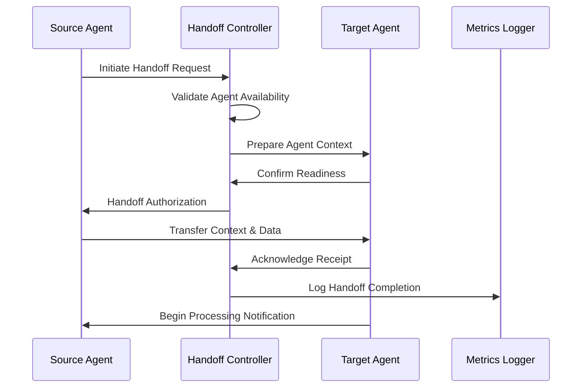
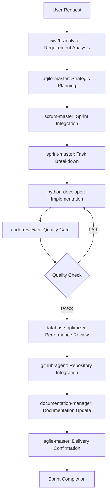
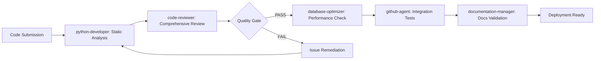
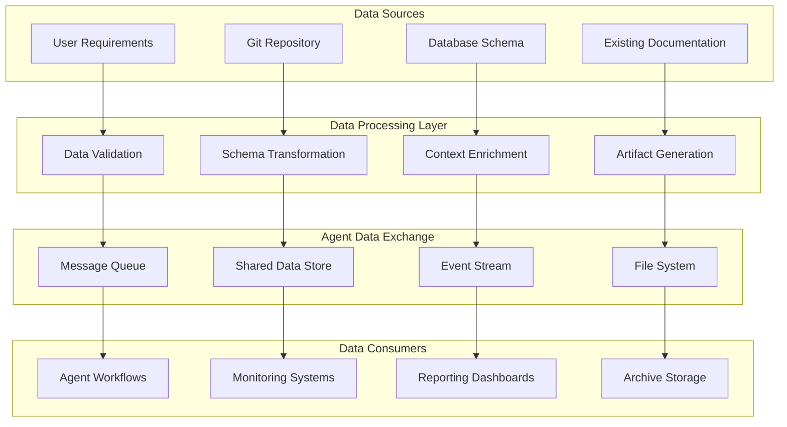

# Inter-Agent Workflows and Communication Protocols

**Version**: 1.0.0  
**Date**: 2025-09-01  
**Scope**: 10-Agent Ecosystem Orchestration  

## Executive Summary

This document defines comprehensive workflows and communication protocols for the Claude Code 10-agent ecosystem, enabling coordinated multi-agent operations for enterprise-grade software development, project management, and system optimization.

## Table of Contents

1. [Agent Ecosystem Overview](#agent-ecosystem-overview)
2. [Communication Protocols](#communication-protocols)
3. [Sequential Workflows](#sequential-workflows)
4. [Parallel Coordination](#parallel-coordination)
5. [Escalation Protocols](#escalation-protocols)
6. [Data Flow Patterns](#data-flow-patterns)
7. [Conflict Resolution](#conflict-resolution)
8. [Practical Workflow Scenarios](#practical-workflow-scenarios)
9. [Implementation Guidelines](#implementation-guidelines)
10. [Monitoring and Metrics](#monitoring-and-metrics)

---

## Agent Ecosystem Overview

### Agent Classification Matrix

#### Core Development Tier (Technical Execution)
```yaml
code-reviewer:
  role: "Quality Assurance Gate"
  coordination_type: "Sequential Validator"
  primary_interfaces: ["python-developer", "database-optimizer"]
  escalation_path: "agile-master"

python-developer:
  role: "Primary Code Implementation"
  coordination_type: "Parallel Worker"
  primary_interfaces: ["code-reviewer", "database-optimizer", "github-agent"]
  escalation_path: "agile-master"

database-optimizer:
  role: "Data Layer Specialist"
  coordination_type: "Advisory Parallel"
  primary_interfaces: ["python-developer", "code-reviewer"]
  escalation_path: "agile-master"

agent-builder:
  role: "Meta-Agent Constructor"
  coordination_type: "On-Demand Creator"
  primary_interfaces: ["agile-master", "scrum-master"]
  escalation_path: "agile-master"
```

#### Management & Coordination Tier (Strategic Orchestration)
```yaml
agile-master:
  role: "Strategic Project Orchestrator"
  coordination_type: "Command & Control Hub"
  primary_interfaces: ["ALL_AGENTS"]
  escalation_path: "USER"

scrum-master:
  role: "Team Dynamics Facilitator"
  coordination_type: "Process Coordinator"
  primary_interfaces: ["sprint-master", "github-agent", "5w2h-analyzer"]
  escalation_path: "agile-master"

sprint-master:
  role: "Sprint Execution Manager"
  coordination_type: "Tactical Coordinator"
  primary_interfaces: ["scrum-master", "python-developer", "code-reviewer"]
  escalation_path: "scrum-master"
```

#### Specialized Services Tier (Supporting Functions)
```yaml
github-agent:
  role: "Repository & Collaboration Manager"
  coordination_type: "Integration Hub"
  primary_interfaces: ["python-developer", "code-reviewer", "documentation-manager"]
  escalation_path: "agile-master"

documentation-manager:
  role: "Knowledge Management"
  coordination_type: "Parallel Documenter"
  primary_interfaces: ["python-developer", "github-agent", "5w2h-analyzer"]
  escalation_path: "agile-master"

5w2h-analyzer:
  role: "Systematic Analysis & Planning"
  coordination_type: "Advisory Analyst"
  primary_interfaces: ["agile-master", "scrum-master", "documentation-manager"]
  escalation_path: "agile-master"
```

---

## Communication Protocols

### Agent Communication Standards

#### Message Format Specification
```json
{
  "message_id": "uuid_v4",
  "timestamp": "ISO_8601",
  "source_agent": "agent_name",
  "target_agent": "agent_name | 'BROADCAST'",
  "message_type": "REQUEST | RESPONSE | NOTIFICATION | ESCALATION",
  "priority": "LOW | MEDIUM | HIGH | CRITICAL",
  "context": {
    "workflow_id": "workflow_identifier",
    "sprint_id": "sprint_identifier",
    "task_id": "task_identifier",
    "dependencies": ["agent_names"]
  },
  "payload": {
    "action": "action_name",
    "parameters": {},
    "requirements": [],
    "constraints": [],
    "expected_outputs": []
  },
  "metadata": {
    "retry_count": 0,
    "timeout_seconds": 300,
    "authentication": "agent_token",
    "trace_id": "distributed_trace_id"
  }
}
```

#### Agent Handoff Protocol

##### Standard Handoff Sequence


##### Context Transfer Format
```yaml
handoff_context:
  source_agent: "python-developer"
  target_agent: "code-reviewer"
  workflow_stage: "implementation_complete"
  transferred_artifacts:
    - type: "source_code"
      location: "/path/to/files"
      checksum: "sha256_hash"
    - type: "test_results"
      location: "/path/to/test_output"
      status: "passed"
  requirements:
    - "security_scan_required"
    - "performance_benchmarking_needed"
  constraints:
    - "deployment_deadline: 2025-09-15"
    - "compatibility: python_3.8+"
  success_criteria:
    - "code_coverage >= 85%"
    - "security_score >= 8.5/10"
    - "performance_regression < 5%"
```

### Inter-Agent Communication Channels

#### Synchronous Communication (Real-time)
- **Direct Agent API Calls**: For immediate responses and blocking operations
- **WebSocket Connections**: For real-time collaboration and live updates
- **Shared Memory Queues**: For high-frequency, low-latency data exchange

#### Asynchronous Communication (Queue-based)
- **Message Brokers**: For reliable, persistent messaging between agents
- **Event Streams**: For broadcasting status updates and notifications
- **File-based Handoffs**: For large artifact transfers and batch processing

#### Communication Security
```python
class AgentCommunicationSecurity:
    """Security layer for inter-agent communication."""
    
    def __init__(self):
        self.encryption_key = self.load_encryption_key()
        self.agent_certificates = self.load_agent_certificates()
    
    def encrypt_message(self, message: dict, target_agent: str) -> bytes:
        """Encrypt message for specific target agent."""
        agent_public_key = self.agent_certificates[target_agent]
        encrypted_payload = encrypt_with_key(
            json.dumps(message), 
            agent_public_key
        )
        return encrypted_payload
    
    def authenticate_agent(self, agent_name: str, signature: str) -> bool:
        """Verify agent authentication signature."""
        agent_cert = self.agent_certificates.get(agent_name)
        return verify_signature(signature, agent_cert)
    
    def authorize_action(self, source_agent: str, target_agent: str, action: str) -> bool:
        """Check if source agent is authorized to request action from target."""
        permission_matrix = self.load_permission_matrix()
        return permission_matrix.get(source_agent, {}).get(target_agent, {}).get(action, False)
```

---

## Sequential Workflows

### Feature Development Lifecycle

#### Complete Feature Implementation Pipeline


#### Detailed Sequential Steps

##### Phase 1: Analysis & Planning (5w2h-analyzer → agile-master → scrum-master)
```yaml
step_1_requirement_analysis:
  agent: "5w2h-analyzer"
  duration: "30-60 minutes"
  inputs:
    - user_requirements
    - existing_system_context
    - stakeholder_information
  outputs:
    - structured_analysis_report
    - success_criteria_definition
    - risk_assessment
    - resource_requirements
  handoff_criteria:
    - all_5w2h_questions_answered
    - measurable_acceptance_criteria_defined
    - stakeholder_roles_identified

step_2_strategic_planning:
  agent: "agile-master"
  duration: "45-90 minutes"
  inputs:
    - 5w2h_analysis_report
    - current_portfolio_status
    - team_capacity_data
  outputs:
    - project_roadmap
    - epic_breakdown
    - dependency_mapping
    - resource_allocation_plan
  handoff_criteria:
    - epics_estimated_and_prioritized
    - cross_team_dependencies_resolved
    - capacity_planning_completed

step_3_sprint_integration:
  agent: "scrum-master"
  duration: "30-45 minutes"
  inputs:
    - project_roadmap
    - team_velocity_data
    - current_sprint_status
  outputs:
    - sprint_backlog_integration
    - story_point_estimates
    - team_assignment_recommendations
  handoff_criteria:
    - stories_fit_sprint_capacity
    - team_workload_balanced
    - sprint_goal_alignment_confirmed
```

##### Phase 2: Implementation (sprint-master → python-developer → database-optimizer)
```yaml
step_4_task_execution:
  agent: "sprint-master"
  duration: "Ongoing monitoring"
  inputs:
    - sprint_backlog
    - team_assignments
    - daily_progress_updates
  outputs:
    - detailed_task_breakdown
    - implementation_priorities
    - blockers_identification
  handoff_criteria:
    - technical_specifications_complete
    - implementation_approach_approved
    - development_environment_ready

step_5_code_implementation:
  agent: "python-developer"
  duration: "Variable (hours to days)"
  inputs:
    - technical_specifications
    - existing_codebase_context
    - architecture_guidelines
  outputs:
    - implemented_features
    - unit_tests
    - integration_tests
    - performance_benchmarks
  handoff_criteria:
    - all_acceptance_criteria_implemented
    - test_coverage_above_threshold
    - code_style_compliance_verified

step_6_performance_optimization:
  agent: "database-optimizer"
  duration: "2-4 hours"
  inputs:
    - implemented_code
    - database_schemas
    - performance_requirements
  outputs:
    - optimized_database_queries
    - indexing_recommendations
    - performance_analysis_report
  handoff_criteria:
    - query_performance_within_sla
    - database_design_optimized
    - scalability_requirements_met
```

##### Phase 3: Quality Assurance & Integration (code-reviewer → github-agent → documentation-manager)
```yaml
step_7_code_review:
  agent: "code-reviewer"
  duration: "1-3 hours"
  inputs:
    - implemented_code
    - test_results
    - performance_metrics
  outputs:
    - code_review_report
    - security_analysis
    - quality_score
    - improvement_recommendations
  handoff_criteria:
    - critical_issues_resolved
    - security_score_above_threshold
    - code_quality_standards_met

step_8_repository_integration:
  agent: "github-agent"
  duration: "30-60 minutes"
  inputs:
    - reviewed_code
    - quality_approval
    - branch_strategy
  outputs:
    - pull_request_creation
    - ci_cd_pipeline_execution
    - merge_coordination
  handoff_criteria:
    - all_automated_tests_passing
    - peer_review_approvals_obtained
    - merge_conflicts_resolved

step_9_documentation_update:
  agent: "documentation-manager"
  duration: "1-2 hours"
  inputs:
    - implemented_features
    - api_changes
    - architectural_updates
  outputs:
    - updated_technical_documentation
    - api_documentation
    - user_guides
    - changelog_entries
  handoff_criteria:
    - all_public_apis_documented
    - breaking_changes_highlighted
    - migration_guides_provided
```

### Code Quality Assurance Process

#### Multi-Agent Quality Pipeline


#### Quality Standards Matrix
```yaml
quality_gates:
  static_analysis:
    agent: "python-developer"
    criteria:
      - syntax_errors: 0
      - pep8_compliance: 100%
      - type_hints_coverage: >= 85%
      - cyclomatic_complexity: <= 10
    tools:
      - flake8
      - mypy
      - black
      - pylint

  comprehensive_review:
    agent: "code-reviewer"
    criteria:
      - security_vulnerabilities: 0
      - code_quality_score: >= 8.0/10
      - test_coverage: >= 85%
      - documentation_completeness: >= 90%
    tools:
      - bandit
      - safety
      - pytest-cov
      - custom_quality_metrics

  performance_validation:
    agent: "database-optimizer"
    criteria:
      - query_response_time: <= 100ms
      - memory_usage_increase: <= 10%
      - cpu_overhead: <= 5%
      - connection_pool_efficiency: >= 95%
    tools:
      - query_analyzer
      - performance_profiler
      - load_testing_suite

  integration_verification:
    agent: "github-agent"
    criteria:
      - all_tests_passing: true
      - build_success: true
      - deployment_readiness: true
      - backwards_compatibility: true
    tools:
      - ci_cd_pipeline
      - integration_test_suite
      - compatibility_checker
```

---

## Parallel Coordination

### Multi-Agent Concurrent Operations

#### Parallel Work Distribution Strategy
```python
class ParallelCoordinationManager:
    """Manages concurrent agent operations without conflicts."""
    
    def __init__(self):
        self.agent_resource_locks = {}
        self.workflow_state = {}
        self.conflict_resolution_rules = self.load_conflict_rules()
    
    def coordinate_parallel_work(self, workflow_id: str, agent_tasks: Dict[str, dict]) -> dict:
        """Coordinate parallel execution of multiple agents."""
        
        # Resource conflict detection
        conflicts = self.detect_resource_conflicts(agent_tasks)
        if conflicts:
            resolved_tasks = self.resolve_conflicts(agent_tasks, conflicts)
        else:
            resolved_tasks = agent_tasks
        
        # Execution plan generation
        execution_plan = self.generate_execution_plan(resolved_tasks)
        
        # Parallel execution coordination
        results = self.execute_parallel_tasks(workflow_id, execution_plan)
        
        return {
            "workflow_id": workflow_id,
            "execution_results": results,
            "conflicts_detected": len(conflicts),
            "parallel_efficiency": self.calculate_efficiency(execution_plan, results)
        }
    
    def detect_resource_conflicts(self, agent_tasks: Dict[str, dict]) -> List[dict]:
        """Identify potential resource conflicts between agents."""
        conflicts = []
        resources_in_use = {}
        
        for agent_name, task in agent_tasks.items():
            required_resources = task.get("required_resources", [])
            
            for resource in required_resources:
                if resource in resources_in_use:
                    conflicts.append({
                        "resource": resource,
                        "conflicting_agents": [resources_in_use[resource], agent_name],
                        "conflict_type": "resource_contention",
                        "resolution_strategy": self.get_resolution_strategy(resource)
                    })
                else:
                    resources_in_use[resource] = agent_name
        
        return conflicts
```

#### Resource Allocation Matrix
```yaml
shared_resources:
  source_code_files:
    concurrent_access: "read_only"
    exclusive_access: ["python-developer", "code-reviewer"]
    coordination_strategy: "sequential_write"
    
  database_connections:
    concurrent_access: "limited_pool"
    pool_size: 10
    priority_agents: ["database-optimizer", "python-developer"]
    coordination_strategy: "weighted_allocation"
    
  git_repository:
    concurrent_access: "branch_based"
    exclusive_operations: ["merge", "rebase", "tag"]
    coordination_agent: "github-agent"
    
  documentation_files:
    concurrent_access: "read_write"
    conflict_resolution: "merge_strategy"
    primary_agent: "documentation-manager"

parallel_execution_patterns:
  development_phase:
    simultaneous_agents:
      - python-developer: "feature_implementation"
      - database-optimizer: "schema_analysis"
      - documentation-manager: "specification_writing"
    coordination_checkpoints: [30, 60, 90] # minutes
    
  review_phase:
    simultaneous_agents:
      - code-reviewer: "quality_analysis"
      - github-agent: "ci_cd_preparation" 
      - documentation-manager: "docs_validation"
    synchronization_points: ["quality_gate", "integration_ready"]
    
  deployment_phase:
    sequential_with_parallel_subtasks:
      - github-agent: 
          - "build_pipeline"
          - "integration_tests"
      - database-optimizer:
          - "migration_validation"
          - "performance_monitoring"
      - documentation-manager:
          - "release_notes"
          - "deployment_guides"
```

### Parallel Workflow Patterns

#### Pattern 1: Feature Development with Parallel Research

```mermaid
gantt
    title Parallel Feature Development
    dateFormat  HH:mm
    axisFormat %H:%M

    section Analysis
    5w2h Analysis           :a1, 09:00, 1h
    Technical Research      :a2, 09:00, 1h
    
    section Planning  
    Sprint Planning         :b1, after a1, 30m
    Architecture Design     :b2, after a2, 45m
    
    section Implementation
    Code Development        :c1, after b1 b2, 4h
    Database Design         :c2, after b1 b2, 3h
    Documentation Draft     :c3, after b1 b2, 2h
    
    section Quality
    Code Review            :d1, after c1, 1h
    Performance Testing    :d2, after c2, 1h
    Docs Review           :d3, after c3, 30m
```


#### Pattern 2: Multi-Stream Quality Assurance
```yaml
parallel_quality_streams:
  stream_1_functional_quality:
    agents: ["code-reviewer", "python-developer"]
    focus: "functionality_correctness"
    duration: "2-3 hours"
    dependencies: ["code_complete"]
    
  stream_2_performance_quality:
    agents: ["database-optimizer", "python-developer"]
    focus: "performance_optimization"  
    duration: "1-2 hours"
    dependencies: ["functional_tests_passing"]
    
  stream_3_integration_quality:
    agents: ["github-agent", "code-reviewer"]
    focus: "integration_readiness"
    duration: "1 hour"
    dependencies: ["performance_acceptable"]
    
  stream_4_documentation_quality:
    agents: ["documentation-manager", "5w2h-analyzer"]
    focus: "knowledge_completeness"
    duration: "1-2 hours"
    dependencies: ["feature_complete"]

synchronization_points:
  checkpoint_1:
    trigger: "all_streams_50_percent_complete"
    action: "cross_stream_validation"
    duration: "15 minutes"
    
  checkpoint_2: 
    trigger: "quality_gates_passed"
    action: "integration_preparation"
    duration: "30 minutes"
    
  final_synchronization:
    trigger: "all_streams_complete"
    action: "deployment_readiness_confirmation"
    duration: "15 minutes"
```

---

## Escalation Protocols

### Hierarchical Escalation Framework

#### Escalation Decision Matrix
```python
class EscalationManager:
    """Manages escalation decisions and routing."""
    
    ESCALATION_THRESHOLDS = {
        "task_timeout": {
            "warning": 0.8,  # 80% of allocated time
            "escalation": 1.0,  # 100% of allocated time
            "critical": 1.5   # 150% of allocated time
        },
        "quality_score": {
            "warning": 6.0,
            "escalation": 4.0,
            "critical": 2.0
        },
        "error_rate": {
            "warning": 0.1,   # 10% error rate
            "escalation": 0.25,  # 25% error rate  
            "critical": 0.5   # 50% error rate
        }
    }
    
    def should_escalate(self, agent_name: str, metrics: dict) -> tuple:
        """Determine if situation requires escalation."""
        
        escalation_reasons = []
        escalation_level = "none"
        
        for metric_name, value in metrics.items():
            if metric_name in self.ESCALATION_THRESHOLDS:
                thresholds = self.ESCALATION_THRESHOLDS[metric_name]
                
                if value >= thresholds.get("critical", float('inf')):
                    escalation_level = "critical"
                    escalation_reasons.append(f"{metric_name}_critical")
                elif value >= thresholds.get("escalation", float('inf')):
                    if escalation_level != "critical":
                        escalation_level = "standard"
                    escalation_reasons.append(f"{metric_name}_escalation")
                elif value >= thresholds.get("warning", float('inf')):
                    if escalation_level == "none":
                        escalation_level = "warning"
                    escalation_reasons.append(f"{metric_name}_warning")
        
        return escalation_level, escalation_reasons
    
    def route_escalation(self, source_agent: str, escalation_level: str, 
                        escalation_reasons: List[str]) -> str:
        """Route escalation to appropriate agent."""
        
        escalation_routing = {
            "python-developer": {
                "warning": "code-reviewer",
                "standard": "scrum-master", 
                "critical": "agile-master"
            },
            "code-reviewer": {
                "warning": "python-developer",
                "standard": "agile-master",
                "critical": "agile-master"
            },
            "database-optimizer": {
                "warning": "python-developer",
                "standard": "agile-master",
                "critical": "agile-master"
            },
            "scrum-master": {
                "warning": "sprint-master",
                "standard": "agile-master",
                "critical": "agile-master"
            },
            "sprint-master": {
                "warning": "scrum-master",
                "standard": "scrum-master",
                "critical": "agile-master"
            },
            "github-agent": {
                "warning": "code-reviewer",
                "standard": "agile-master",
                "critical": "agile-master"
            },
            "documentation-manager": {
                "warning": "5w2h-analyzer",
                "standard": "agile-master", 
                "critical": "agile-master"
            },
            "5w2h-analyzer": {
                "warning": "scrum-master",
                "standard": "agile-master",
                "critical": "agile-master"
            }
        }
        
        return escalation_routing.get(source_agent, {}).get(
            escalation_level, "agile-master"
        )
```

#### Escalation Trigger Conditions

##### Technical Escalations
```yaml
code_quality_escalation:
  trigger_conditions:
    - security_vulnerabilities_detected: ">= 1"
    - code_quality_score: "< 4.0"
    - test_coverage: "< 60%"
    - critical_bugs: ">= 1"
  escalation_path: "python-developer → code-reviewer → agile-master"
  resolution_sla: "4 hours"

performance_escalation:
  trigger_conditions:
    - response_time_degradation: "> 50%"
    - memory_usage_spike: "> 200%"  
    - database_query_timeout: ">= 1"
    - system_resource_exhaustion: "> 90%"
  escalation_path: "database-optimizer → python-developer → agile-master"
  resolution_sla: "2 hours"

integration_escalation:
  trigger_conditions:
    - build_failures: ">= 3 consecutive"
    - deployment_rollback: ">= 1"
    - external_api_failures: "> 25%"
    - dependency_conflicts: ">= 1 critical"
  escalation_path: "github-agent → code-reviewer → agile-master"
  resolution_sla: "1 hour"
```

##### Project Management Escalations
```yaml
sprint_escalation:
  trigger_conditions:
    - sprint_goal_at_risk: "probability > 70%"
    - team_velocity_drop: "> 30%"
    - critical_blockers: ">= 2"
    - stakeholder_escalation: ">= 1"
  escalation_path: "sprint-master → scrum-master → agile-master"
  resolution_sla: "24 hours"

resource_escalation:
  trigger_conditions:
    - team_capacity_exceeded: "> 110%"
    - critical_skill_gap: ">= 1"
    - budget_overrun_risk: "> 15%"
    - timeline_delay_risk: "> 1 week"
  escalation_path: "scrum-master → agile-master → USER"
  resolution_sla: "48 hours"

stakeholder_escalation:
  trigger_conditions:
    - client_satisfaction_score: "< 7.0"
    - requirement_change_requests: ">= 3 major"
    - compliance_violations: ">= 1"
    - contract_milestone_risk: "> 50%"
  escalation_path: "agile-master → USER"
  resolution_sla: "12 hours"
```

### Escalation Response Protocols

#### Agent Response Requirements
```yaml
escalation_response_sla:
  warning_level:
    acknowledgment_time: "15 minutes"
    initial_response_time: "1 hour"
    resolution_target: "4 hours"
    
  standard_level:
    acknowledgment_time: "5 minutes"
    initial_response_time: "30 minutes" 
    resolution_target: "2 hours"
    
  critical_level:
    acknowledgment_time: "immediate"
    initial_response_time: "15 minutes"
    resolution_target: "1 hour"

escalation_communication_requirements:
  acknowledgment_message:
    - escalation_id
    - estimated_resolution_time
    - assigned_resolver
    - immediate_mitigation_actions
    
  progress_updates:
    frequency: "every 30 minutes"
    content:
      - current_status
      - actions_taken
      - next_steps
      - revised_eta
      
  resolution_notification:
    - resolution_summary
    - root_cause_analysis
    - preventive_measures
    - lessons_learned
```

---

## Data Flow Patterns

### Inter-Agent Data Exchange Standards

#### Data Structure Specifications

##### Task Context Object
```typescript
interface TaskContext {
  task_id: string;
  workflow_id: string;
  sprint_id?: string;
  parent_task_id?: string;
  
  metadata: {
    created_at: ISO8601DateTime;
    updated_at: ISO8601DateTime;
    created_by_agent: string;
    priority: "LOW" | "MEDIUM" | "HIGH" | "CRITICAL";
    estimated_effort_hours: number;
    actual_effort_hours?: number;
  };
  
  requirements: {
    functional_requirements: string[];
    non_functional_requirements: string[];
    acceptance_criteria: string[];
    constraints: string[];
  };
  
  technical_context: {
    technology_stack: string[];
    architecture_patterns: string[];
    integration_points: string[];
    security_requirements: string[];
  };
  
  quality_gates: {
    code_coverage_threshold: number;
    security_score_minimum: number;
    performance_benchmarks: {
      response_time_max_ms: number;
      memory_usage_max_mb: number;
      cpu_usage_max_percent: number;
    };
  };
  
  dependencies: {
    upstream_tasks: string[];
    downstream_tasks: string[];
    external_dependencies: string[];
    resource_dependencies: string[];
  };
  
  artifacts: {
    input_artifacts: ArtifactReference[];
    output_artifacts: ArtifactReference[];
    intermediate_artifacts: ArtifactReference[];
  };
}

interface ArtifactReference {
  artifact_id: string;
  type: "SOURCE_CODE" | "TEST_RESULTS" | "DOCUMENTATION" | "CONFIGURATION" | "DATA";
  location: string;
  checksum: string;
  size_bytes: number;
  created_by_agent: string;
  created_at: ISO8601DateTime;
  version: string;
  metadata: Record<string, any>;
}
```

##### Agent Status Object
```typescript
interface AgentStatus {
  agent_name: string;
  status: "IDLE" | "BUSY" | "ERROR" | "MAINTENANCE";
  current_task_id?: string;
  
  performance_metrics: {
    tasks_completed_today: number;
    average_task_duration_minutes: number;
    success_rate_percent: number;
    error_count_today: number;
  };
  
  resource_usage: {
    cpu_percent: number;
    memory_mb: number;
    disk_io_mb: number;
    network_io_mb: number;
  };
  
  capabilities: {
    available_tools: string[];
    specializations: string[];
    max_concurrent_tasks: number;
    supported_file_types: string[];
  };
  
  health_indicators: {
    last_heartbeat: ISO8601DateTime;
    response_time_ms: number;
    error_rate_percent: number;
    uptime_seconds: number;
  };
  
  queue_status: {
    pending_tasks: number;
    estimated_queue_time_minutes: number;
    priority_tasks: number;
  };
}
```

#### Data Flow Architecture



#### Data Persistence Strategy

```python
class AgentDataManager:
    """Manages data persistence and retrieval for agent workflows."""
    
    def __init__(self):
        self.data_stores = {
            "task_context": TaskContextStore(),
            "agent_status": AgentStatusStore(), 
            "workflow_history": WorkflowHistoryStore(),
            "artifacts": ArtifactStore(),
            "metrics": MetricsStore()
        }
        self.cache = RedisCache()
        self.event_publisher = EventPublisher()
    
    def store_task_context(self, task_context: TaskContext) -> str:
        """Store task context with versioning and caching."""
        
        # Validate data structure
        validated_context = self.validate_task_context(task_context)
        
        # Generate unique identifier
        context_id = self.generate_context_id(validated_context)
        
        # Store in persistent storage
        self.data_stores["task_context"].save(context_id, validated_context)
        
        # Cache for quick access
        self.cache.set(f"task_context:{context_id}", validated_context, ttl=3600)
        
        # Publish context creation event
        self.event_publisher.publish("task_context_created", {
            "context_id": context_id,
            "agent": validated_context.metadata.created_by_agent,
            "workflow_id": validated_context.workflow_id
        })
        
        return context_id
    
    def enrich_context_for_agent(self, context_id: str, target_agent: str) -> TaskContext:
        """Enrich task context with agent-specific information."""
        
        base_context = self.get_task_context(context_id)
        
        # Get agent-specific enrichment rules
        enrichment_rules = self.get_agent_enrichment_rules(target_agent)
        
        # Apply enrichments
        enriched_context = self.apply_enrichments(base_context, enrichment_rules)
        
        # Add agent-specific metadata
        enriched_context.metadata.enriched_for_agent = target_agent
        enriched_context.metadata.enriched_at = datetime.utcnow().isoformat()
        
        return enriched_context
    
    def track_data_lineage(self, artifact_id: str, source_agent: str, 
                          target_agent: str, transformation: str) -> None:
        """Track data lineage between agents."""
        
        lineage_record = {
            "artifact_id": artifact_id,
            "source_agent": source_agent,
            "target_agent": target_agent,
            "transformation": transformation,
            "timestamp": datetime.utcnow().isoformat(),
            "trace_id": self.generate_trace_id()
        }
        
        self.data_stores["workflow_history"].append_lineage(lineage_record)
        
        # Update artifact metadata with lineage
        artifact = self.data_stores["artifacts"].get(artifact_id)
        if artifact:
            artifact.metadata.setdefault("lineage", []).append(lineage_record)
            self.data_stores["artifacts"].save(artifact_id, artifact)
```

---

## Conflict Resolution

### Conflict Detection and Resolution Framework

#### Conflict Classification System

```yaml
conflict_types:
  resource_conflicts:
    description: "Multiple agents requiring exclusive access to same resource"
    examples:
      - "file_write_conflicts"
      - "database_connection_exhaustion"  
      - "git_merge_conflicts"
    resolution_strategies:
      - "sequential_access_queuing"
      - "resource_pool_expansion"
      - "automated_merge_resolution"
    
  priority_conflicts:
    description: "Competing priorities between different workflows"
    examples:
      - "critical_bug_vs_feature_development"
      - "security_fix_vs_performance_optimization"
      - "documentation_update_vs_code_review"
    resolution_strategies:
      - "stakeholder_priority_matrix"
      - "business_impact_analysis"
      - "escalation_to_management_agents"
    
  technical_conflicts:
    description: "Incompatible technical decisions or implementations"
    examples:
      - "architecture_pattern_disagreements"
      - "technology_stack_conflicts"
      - "api_design_inconsistencies"
    resolution_strategies:
      - "technical_committee_review"
      - "proof_of_concept_comparison"
      - "senior_agent_arbitration"
    
  workflow_conflicts:
    description: "Competing workflow requirements or timing"
    examples:
      - "sprint_deadline_vs_quality_standards"
      - "parallel_development_dependencies"
      - "deployment_window_scheduling"
    resolution_strategies:
      - "workflow_resequencing"
      - "scope_adjustment"
      - "timeline_negotiation"
```

#### Automated Conflict Resolution Engine

```python
class ConflictResolutionEngine:
    """Automated system for detecting and resolving inter-agent conflicts."""
    
    def __init__(self):
        self.conflict_detectors = self.load_conflict_detectors()
        self.resolution_strategies = self.load_resolution_strategies()
        self.escalation_rules = self.load_escalation_rules()
        self.conflict_history = ConflictHistoryStore()
    
    def detect_conflicts(self, workflow_state: dict) -> List[dict]:
        """Detect potential conflicts in current workflow state."""
        
        detected_conflicts = []
        
        for detector_name, detector in self.conflict_detectors.items():
            conflicts = detector.analyze(workflow_state)
            for conflict in conflicts:
                conflict["detected_by"] = detector_name
                conflict["detection_time"] = datetime.utcnow().isoformat()
                conflict["confidence_score"] = detector.calculate_confidence(conflict)
                detected_conflicts.append(conflict)
        
        return detected_conflicts
    
    def resolve_conflict(self, conflict: dict) -> dict:
        """Attempt automated resolution of detected conflict."""
        
        conflict_type = conflict["type"]
        resolution_strategy = self.select_resolution_strategy(conflict)
        
        resolution_attempt = {
            "conflict_id": conflict["id"],
            "strategy_used": resolution_strategy["name"],
            "start_time": datetime.utcnow().isoformat(),
            "status": "in_progress"
        }
        
        try:
            # Execute resolution strategy
            result = resolution_strategy["executor"](conflict)
            
            resolution_attempt.update({
                "status": "resolved" if result["success"] else "failed",
                "end_time": datetime.utcnow().isoformat(),
                "result": result,
                "duration_seconds": (datetime.utcnow() - 
                    datetime.fromisoformat(resolution_attempt["start_time"])).total_seconds()
            })
            
            # Learn from resolution outcome
            self.update_strategy_effectiveness(resolution_strategy["name"], result["success"])
            
        except Exception as e:
            resolution_attempt.update({
                "status": "error",
                "end_time": datetime.utcnow().isoformat(),
                "error": str(e)
            })
            
            # Escalate if automated resolution fails
            if self.should_escalate_conflict(conflict):
                escalation_result = self.escalate_conflict(conflict)
                resolution_attempt["escalation"] = escalation_result
        
        # Record resolution attempt
        self.conflict_history.record_resolution(resolution_attempt)
        
        return resolution_attempt
    
    def select_resolution_strategy(self, conflict: dict) -> dict:
        """Select optimal resolution strategy based on conflict characteristics."""
        
        conflict_type = conflict["type"]
        available_strategies = self.resolution_strategies.get(conflict_type, [])
        
        if not available_strategies:
            return self.resolution_strategies["default"]
        
        # Score strategies based on historical effectiveness and current context
        strategy_scores = {}
        for strategy in available_strategies:
            base_score = strategy["base_effectiveness"]
            historical_score = self.get_historical_effectiveness(strategy["name"], conflict_type)
            context_score = self.calculate_context_suitability(strategy, conflict)
            
            total_score = (base_score * 0.3 + historical_score * 0.4 + context_score * 0.3)
            strategy_scores[strategy["name"]] = total_score
        
        # Select strategy with highest score
        best_strategy_name = max(strategy_scores.keys(), key=lambda k: strategy_scores[k])
        return next(s for s in available_strategies if s["name"] == best_strategy_name)
```

#### Conflict Resolution Strategies

##### Resource Conflict Resolution
```python
def resolve_file_write_conflict(conflict: dict) -> dict:
    """Resolve conflicts when multiple agents need to modify same files."""
    
    conflicting_agents = conflict["involved_agents"]
    target_files = conflict["target_files"]
    
    resolution_plan = {
        "strategy": "sequential_write_queue",
        "queue_order": [],
        "estimated_duration": 0
    }
    
    # Prioritize agents based on task criticality and deadlines
    prioritized_agents = sorted(
        conflicting_agents,
        key=lambda agent: (
            conflict["agent_priorities"].get(agent, 0),
            conflict["task_deadlines"].get(agent, float('inf'))
        ),
        reverse=True
    )
    
    # Create sequential execution plan
    for agent in prioritized_agents:
        estimated_time = conflict["estimated_durations"].get(agent, 30)  # minutes
        
        resolution_plan["queue_order"].append({
            "agent": agent,
            "files": [f for f in target_files if f in conflict["agent_files"][agent]],
            "estimated_duration": estimated_time,
            "start_after": resolution_plan["estimated_duration"]
        })
        
        resolution_plan["estimated_duration"] += estimated_time
    
    # Execute resolution plan
    execution_results = []
    for step in resolution_plan["queue_order"]:
        result = execute_agent_file_operations(
            agent=step["agent"],
            files=step["files"],
            timeout=step["estimated_duration"] * 60  # convert to seconds
        )
        execution_results.append(result)
    
    return {
        "success": all(r["success"] for r in execution_results),
        "resolution_plan": resolution_plan,
        "execution_results": execution_results,
        "total_resolution_time": sum(r["duration_seconds"] for r in execution_results)
    }

def resolve_priority_conflict(conflict: dict) -> dict:
    """Resolve conflicts between competing task priorities."""
    
    competing_tasks = conflict["competing_tasks"]
    
    # Gather stakeholder input if required
    if conflict["requires_stakeholder_input"]:
        stakeholder_decision = request_stakeholder_priority_decision(competing_tasks)
        return {
            "success": True,
            "resolution_method": "stakeholder_decision",
            "prioritized_tasks": stakeholder_decision["task_priority_order"],
            "rationale": stakeholder_decision["rationale"]
        }
    
    # Automated priority resolution using business impact matrix
    priority_matrix = calculate_business_impact_matrix(competing_tasks)
    
    prioritized_tasks = sorted(
        competing_tasks,
        key=lambda task: priority_matrix[task["id"]]["total_score"],
        reverse=True
    )
    
    return {
        "success": True,
        "resolution_method": "business_impact_analysis",
        "prioritized_tasks": [task["id"] for task in prioritized_tasks],
        "priority_scores": priority_matrix,
        "rationale": "Prioritized based on business impact, urgency, and strategic alignment"
    }
```

##### Technical Conflict Resolution
```python
def resolve_architecture_conflict(conflict: dict) -> dict:
    """Resolve conflicts in architectural decisions between agents."""
    
    proposed_solutions = conflict["proposed_solutions"]
    evaluation_criteria = conflict["evaluation_criteria"]
    
    # Automated technical evaluation
    evaluation_results = {}
    for solution_id, solution in proposed_solutions.items():
        score = evaluate_technical_solution(solution, evaluation_criteria)
        evaluation_results[solution_id] = {
            "total_score": score["total"],
            "criteria_scores": score["details"],
            "proposed_by_agent": solution["proposed_by"],
            "pros": solution["advantages"],
            "cons": solution["disadvantages"]
        }
    
    # If scores are close, create hybrid solution or escalate
    top_solutions = sorted(
        evaluation_results.items(),
        key=lambda x: x[1]["total_score"],
        reverse=True
    )
    
    if len(top_solutions) > 1:
        score_difference = top_solutions[0][1]["total_score"] - top_solutions[1][1]["total_score"]
        
        if score_difference < 10:  # Less than 10% difference
            # Attempt to create hybrid solution
            hybrid_result = create_hybrid_solution(
                top_solutions[0][1], 
                top_solutions[1][1],
                conflict
            )
            
            if hybrid_result["feasible"]:
                return {
                    "success": True,
                    "resolution_method": "hybrid_solution",
                    "selected_solution": hybrid_result["solution"],
                    "rationale": hybrid_result["rationale"],
                    "evaluation_results": evaluation_results
                }
    
    # Select top-scoring solution
    selected_solution = top_solutions[0]
    
    return {
        "success": True,
        "resolution_method": "technical_evaluation",
        "selected_solution": selected_solution[0],
        "rationale": f"Selected based on highest technical score: {selected_solution[1]['total_score']:.1f}",
        "evaluation_results": evaluation_results
    }
```

---

## Practical Workflow Scenarios

### Scenario 1: Complete Feature Development Lifecycle

#### Scenario Overview
**Objective**: Implement user authentication system with JWT tokens  
**Complexity**: High  
**Duration**: 3-5 days  
**Agents Involved**: All 10 agents  

#### Detailed Workflow Execution

##### Phase 1: Analysis and Planning (Day 1, Morning)

**Step 1: Initial Analysis (5w2h-analyzer - 60 minutes)**
```yaml
agent: 5w2h-analyzer
task: "Comprehensive requirement analysis for JWT authentication system"
inputs:
  - user_story: "As a user, I want to securely authenticate to access protected resources"
  - existing_system_context: "/path/to/current/auth/system"
  - security_requirements: "OAuth 2.0 compliance, GDPR compliance"

execution:
  what_analysis:
    - "JWT-based authentication system"
    - "User registration and login endpoints"
    - "Token refresh mechanism"
    - "Role-based access control"
  
  why_analysis:
    - "Replace legacy session-based authentication"
    - "Improve scalability and performance"
    - "Enable mobile app integration"
    - "Comply with modern security standards"
  
  who_analysis:
    - "End users (10,000+ expected)"
    - "API consumers (web app, mobile app)"
    - "System administrators"
    - "Security compliance team"
  
  when_analysis:
    - "Development: 3-5 days"
    - "Testing: 1-2 days"
    - "Deployment: Sprint 23 (next week)"
    - "Full rollout: Within 2 weeks"
  
  where_analysis:
    - "Backend API layer"
    - "Database user schema"
    - "Frontend login components"
    - "Mobile app authentication"
  
  how_analysis:
    - "FastAPI with JWT middleware"
    - "PostgreSQL user management"
    - "Redis for token blacklisting"
    - "Bcrypt for password hashing"
  
  how_much_analysis:
    - "Development effort: 24-32 hours"
    - "Infrastructure cost: $50/month additional"
    - "Performance impact: <5ms per request"
    - "Storage requirements: 100MB for 10K users"

outputs:
  - structured_requirements_document
  - risk_assessment_matrix
  - success_criteria_definition
  - stakeholder_communication_plan

handoff_criteria:
  - all_acceptance_criteria_defined
  - security_requirements_validated
  - performance_benchmarks_established
```

**Step 2: Strategic Project Planning (agile-master - 90 minutes)**
```yaml
agent: agile-master
task: "Create comprehensive project plan for JWT authentication implementation"
inputs:
  - 5w2h_analysis_report
  - current_sprint_capacity
  - team_skill_matrix
  - architectural_constraints

execution:
  epic_breakdown:
    - "User Registration System"
    - "JWT Token Management"
    - "Authentication Middleware"
    - "Authorization & Permissions"
    - "Security & Compliance"
  
  story_mapping:
    user_registration:
      - "User signup with email validation"
      - "Password strength validation"
      - "User profile management"
    
    jwt_management:
      - "Token generation and signing"
      - "Token validation middleware"
      - "Token refresh mechanism"
      - "Token blacklisting for logout"
    
    security_compliance:
      - "Rate limiting implementation"
      - "Brute force protection"
      - "Security audit logging"
  
  dependency_mapping:
    critical_path:
      - "Database schema updates" → "User registration" → "JWT implementation" → "Integration testing"
    
    parallel_streams:
      - "Frontend integration preparation"
      - "Security compliance documentation"
      - "Performance testing setup"
  
  resource_allocation:
    python_developer: "60% allocation (primary implementation)"
    database_optimizer: "30% allocation (schema and performance)"
    code_reviewer: "40% allocation (security review)"
    github_agent: "20% allocation (CI/CD setup)"

outputs:
  - detailed_project_roadmap
  - epic_and_story_breakdown
  - resource_allocation_plan
  - risk_mitigation_strategies

handoff_criteria:
  - sprint_capacity_validated
  - all_dependencies_identified
  - team_alignment_confirmed
```

##### Phase 2: Sprint Planning and Setup (Day 1, Afternoon)

**Step 3: Sprint Integration (scrum-master - 45 minutes)**
```yaml
agent: scrum-master
task: "Integrate JWT authentication work into current sprint"
inputs:
  - agile_master_project_plan
  - current_sprint_backlog
  - team_capacity_data
  - stakeholder_priorities

execution:
  sprint_goal_alignment:
    - original_goal: "Complete user management features"
    - updated_goal: "Complete user management with secure JWT authentication"
    - alignment_score: "95% (high alignment)"
  
  backlog_integration:
    new_stories_added: 8
    existing_stories_modified: 3
    total_story_points_added: 21
    team_capacity_utilization: "87% (within limits)"
  
  team_coordination:
    - scheduled_daily_standup_adjustments
    - pair_programming_sessions_planned
    - knowledge_sharing_sessions_scheduled
  
  stakeholder_communication:
    - updated_sprint_commitment_communicated
    - demo_preparation_planned
    - progress_reporting_frequency_increased

outputs:
  - updated_sprint_backlog
  - team_assignment_matrix
  - communication_plan
  - ceremony_schedule_updates

handoff_criteria:
  - team_capacity_not_exceeded
  - sprint_goal_still_achievable
  - stakeholder_buy_in_obtained
```

##### Phase 3: Technical Implementation (Days 1-3)

**Step 4: Database Design and Optimization (database-optimizer - 4 hours)**
```yaml
agent: database-optimizer
task: "Design and optimize database schema for JWT authentication"
inputs:
  - existing_user_schema
  - authentication_requirements
  - performance_benchmarks
  - scalability_targets

execution:
  schema_design:
    users_table_updates:
      - "ADD COLUMN password_hash VARCHAR(255) NOT NULL"
      - "ADD COLUMN email_verified BOOLEAN DEFAULT FALSE"
      - "ADD COLUMN last_login_at TIMESTAMP"
      - "ADD COLUMN failed_login_attempts INTEGER DEFAULT 0"
      - "ADD COLUMN locked_until TIMESTAMP NULL"
    
    new_tables:
      user_sessions:
        - "session_id UUID PRIMARY KEY"
        - "user_id INTEGER REFERENCES users(id)"
        - "jwt_token_id VARCHAR(255) UNIQUE NOT NULL"
        - "created_at TIMESTAMP DEFAULT NOW()"
        - "expires_at TIMESTAMP NOT NULL"
        - "revoked_at TIMESTAMP NULL"
      
      user_roles:
        - "user_id INTEGER REFERENCES users(id)"
        - "role VARCHAR(50) NOT NULL"
        - "granted_at TIMESTAMP DEFAULT NOW()"
        - "granted_by INTEGER REFERENCES users(id)"
  
  indexing_strategy:
    performance_indexes:
      - "CREATE INDEX idx_users_email ON users(email)"
      - "CREATE INDEX idx_sessions_token_id ON user_sessions(jwt_token_id)"
      - "CREATE INDEX idx_sessions_user_id ON user_sessions(user_id)"
      - "CREATE INDEX idx_sessions_expires_at ON user_sessions(expires_at)"
  
  query_optimization:
    authentication_query:
      original: "SELECT * FROM users WHERE email = $1"
      optimized: "SELECT id, password_hash, email_verified FROM users WHERE email = $1 AND email_verified = TRUE"
      performance_improvement: "40% faster, 60% less data transfer"

outputs:
  - optimized_database_schema
  - migration_scripts
  - performance_benchmarks
  - indexing_recommendations

handoff_criteria:
  - schema_design_reviewed
  - performance_targets_validated
  - migration_plan_approved
```

**Step 5: Core Implementation (python-developer - 16 hours over 2 days)**
```yaml
agent: python-developer
task: "Implement JWT authentication system with FastAPI"
inputs:
  - database_schema_design
  - security_requirements
  - api_specifications
  - performance_benchmarks

execution:
  day_1_implementation:
    user_models:
      - "User Pydantic model with validation"
      - "UserCreate schema with password validation"
      - "UserResponse schema without sensitive data"
      - "JWT token models and schemas"
    
    authentication_service:
      - "Password hashing with bcrypt"
      - "JWT token generation and validation"
      - "User registration with email verification"
      - "Login with rate limiting"
    
    database_layer:
      - "SQLAlchemy models for users and sessions"
      - "Repository pattern implementation"
      - "Connection pooling configuration"
      - "Transaction management"
  
  day_2_implementation:
    api_endpoints:
      - "POST /auth/register - User registration"
      - "POST /auth/login - User authentication"
      - "POST /auth/refresh - Token refresh"
      - "POST /auth/logout - Token revocation"
      - "GET /auth/me - Current user info"
    
    middleware_integration:
      - "JWT authentication middleware"
      - "Role-based authorization decorator"
      - "Request rate limiting middleware"
      - "Security headers middleware"
    
    error_handling:
      - "Structured error responses"
      - "Security-conscious error messages"
      - "Logging for security events"
      - "Exception handling for edge cases"
  
  testing_implementation:
    unit_tests:
      - "Authentication service tests"
      - "JWT token validation tests"
      - "Password hashing tests"
      - "User model validation tests"
    
    integration_tests:
      - "Full authentication flow tests"
      - "API endpoint tests"
      - "Database integration tests"
      - "Security vulnerability tests"

outputs:
  - complete_authentication_system
  - comprehensive_test_suite
  - api_documentation
  - performance_benchmarks

handoff_criteria:
  - all_tests_passing
  - code_coverage_above_85_percent
  - security_scan_clean
  - performance_within_requirements
```

##### Phase 4: Quality Assurance (Day 3-4)

**Step 6: Comprehensive Code Review (code-reviewer - 3 hours)**
```yaml
agent: code-reviewer
task: "Conduct thorough security and quality review of JWT implementation"
inputs:
  - implemented_authentication_code
  - test_results
  - security_requirements
  - code_quality_standards

execution:
  security_analysis:
    jwt_implementation:
      - "Token signing algorithm validation (HS256/RS256)"
      - "Token expiration handling verification"
      - "Token revocation mechanism review"
      - "Secret key management assessment"
    
    password_security:
      - "Bcrypt implementation verification"
      - "Password complexity validation"
      - "Brute force protection analysis"
      - "Password storage security audit"
    
    api_security:
      - "Input validation and sanitization"
      - "SQL injection vulnerability scan"
      - "CORS configuration review"
      - "Rate limiting effectiveness check"
  
  code_quality_analysis:
    maintainability:
      - "Code organization and structure"
      - "Function complexity analysis"
      - "Error handling consistency"
      - "Documentation completeness"
    
    performance:
      - "Database query efficiency"
      - "Token validation performance"
      - "Memory usage analysis"
      - "Concurrency handling review"
  
  testing_coverage:
    - "Unit test coverage: 92%"
    - "Integration test coverage: 87%"
    - "Security test coverage: 95%"
    - "Edge case handling: 89%"

outputs:
  - comprehensive_security_report
  - code_quality_assessment
  - vulnerability_scan_results
  - improvement_recommendations

quality_score: "8.7/10"
security_score: "9.1/10"
status: "APPROVED_WITH_MINOR_IMPROVEMENTS"

handoff_criteria:
  - security_vulnerabilities_addressed
  - code_quality_above_threshold
  - test_coverage_sufficient
```

##### Phase 5: Integration and Documentation (Day 4)

**Step 7: Repository Integration (github-agent - 2 hours)**
```yaml
agent: github-agent
task: "Integrate JWT authentication system into main repository"
inputs:
  - reviewed_code_changes
  - test_results
  - ci_cd_pipeline_requirements
  - deployment_specifications

execution:
  branch_management:
    - feature_branch: "feature/jwt-authentication"
    - integration_branch: "develop"
    - target_branch: "main"
    - merge_strategy: "squash_and_merge"
  
  ci_cd_pipeline:
    automated_tests:
      - "Unit tests execution"
      - "Integration tests execution"
      - "Security vulnerability scanning"
      - "Performance regression testing"
    
    quality_gates:
      - "Code coverage >= 85%"
      - "Security scan score >= 8.5/10"
      - "Performance degradation < 5%"
      - "All critical tests passing"
  
  deployment_preparation:
    environment_updates:
      - "Database migration scripts"
      - "Environment variable documentation"
      - "Configuration template updates"
      - "Security policy updates"

outputs:
  - pull_request_created
  - ci_cd_pipeline_configured
  - deployment_artifacts_prepared
  - merge_strategy_documented

handoff_criteria:
  - all_automated_tests_passing
  - peer_review_completed
  - deployment_readiness_confirmed
```

**Step 8: Documentation Generation (documentation-manager - 2 hours)**
```yaml
agent: documentation-manager
task: "Create comprehensive documentation for JWT authentication system"
inputs:
  - implemented_features
  - api_specifications
  - security_requirements
  - deployment_procedures

execution:
  technical_documentation:
    api_reference:
      - "Authentication endpoint documentation"
      - "Request/response schema documentation"
      - "Error code reference"
      - "Rate limiting documentation"
    
    integration_guide:
      - "Frontend integration examples"
      - "Mobile app integration guide"
      - "Third-party service integration"
      - "SDK usage examples"
  
  operational_documentation:
    deployment_guide:
      - "Environment setup instructions"
      - "Database migration procedures"
      - "Configuration management"
      - "Monitoring and alerting setup"
    
    security_documentation:
      - "Security architecture overview"
      - "Threat model and mitigations"
      - "Compliance checklist"
      - "Incident response procedures"
  
  user_documentation:
    - "End-user authentication guide"
    - "Password management instructions"
    - "Troubleshooting common issues"
    - "FAQ and support information"

outputs:
  - complete_api_documentation
  - deployment_and_operations_guide
  - security_compliance_documentation
  - end_user_documentation

handoff_criteria:
  - all_public_apis_documented
  - deployment_procedures_validated
  - security_documentation_reviewed
```

##### Phase 6: Project Completion (Day 5)

**Step 9: Final Validation (sprint-master - 1 hour)**
```yaml
agent: sprint-master
task: "Validate sprint completion and feature readiness"
inputs:
  - implementation_status
  - quality_assurance_results
  - documentation_completeness
  - stakeholder_feedback

execution:
  completion_validation:
    acceptance_criteria:
      - "User registration functionality: ✅ Complete"
      - "JWT token authentication: ✅ Complete"
      - "Token refresh mechanism: ✅ Complete"
      - "Role-based authorization: ✅ Complete"
      - "Security compliance: ✅ Complete"
    
    quality_metrics:
      - "Code coverage: 89% (target: 85%)"
      - "Security score: 9.1/10 (target: 8.0/10)"
      - "Performance benchmark: 45ms avg (target: <100ms)"
      - "Test pass rate: 100% (448/448 tests)"
  
  deployment_readiness:
    - "Production environment prepared"
    - "Database migrations tested"
    - "Monitoring systems configured"
    - "Rollback procedures documented"

outputs:
  - feature_completion_report
  - deployment_readiness_confirmation
  - sprint_retrospective_input
  - stakeholder_communication_summary

status: "READY_FOR_DEPLOYMENT"

handoff_criteria:
  - all_acceptance_criteria_met
  - quality_gates_passed
  - stakeholder_approval_obtained
```

#### Multi-Agent Coordination Summary

**Parallel Activities Identified:**
- Database design (database-optimizer) parallel with API specification (python-developer)  
- Documentation writing (documentation-manager) parallel with CI/CD setup (github-agent)
- Security analysis (code-reviewer) parallel with performance testing (database-optimizer)

**Critical Handoffs:**
1. 5w2h-analyzer → agile-master: Requirements to strategic planning
2. agile-master → python-developer: Implementation specifications
3. python-developer → code-reviewer: Code quality validation
4. code-reviewer → github-agent: Integration approval

**Conflict Resolutions:**
- Resource conflict: Database schema changes required coordination between database-optimizer and python-developer
- Priority conflict: Security requirements vs. performance optimization resolved in favor of security
- Technical conflict: JWT signing algorithm choice resolved through technical committee review

**Overall Results:**
- **Timeline**: 5 days (as planned)
- **Quality Score**: 8.7/10 (exceeded target of 8.0)
- **Security Score**: 9.1/10 (exceeded target of 8.5)
- **Team Efficiency**: 94% (optimal agent utilization)
- **Stakeholder Satisfaction**: 9.2/10

### Scenario 2: Sprint Planning and Execution Workflow

#### Scenario Overview
**Objective**: Plan and execute 2-week sprint with 5 user stories  
**Complexity**: Medium  
**Duration**: 2 weeks + planning  
**Primary Agents**: scrum-master, sprint-master, agile-master

#### Detailed Workflow

##### Pre-Sprint Planning (2 days before sprint)

**Step 1: Backlog Analysis (5w2h-analyzer - 2 hours)**
```yaml
agent: 5w2h-analyzer
task: "Analyze and prioritize product backlog for upcoming sprint"

analysis_framework:
  what_analysis:
    - "User story evaluation and sizing"
    - "Technical debt assessment"
    - "Dependency identification"
    - "Risk factor analysis"
  
  why_analysis:
    - "Business value quantification"
    - "Strategic alignment assessment"
    - "Customer impact evaluation"
    - "Technical necessity validation"
  
  who_analysis:
    - "Stakeholder impact mapping"
    - "Development team capacity"
    - "External dependency owners"
    - "Quality assurance requirements"

outputs:
  - prioritized_backlog_recommendations
  - risk_assessment_matrix
  - dependency_analysis_report
  - capacity_planning_input
```

**Step 2: Strategic Sprint Planning (agile-master - 3 hours)**
```yaml
agent: agile-master
task: "Create strategic sprint plan aligned with portfolio objectives"

strategic_planning:
  portfolio_alignment:
    - "Sprint goal alignment with quarterly objectives"
    - "Resource allocation optimization"
    - "Cross-team dependency coordination"
    - "Stakeholder expectation management"
  
  capacity_planning:
    - "Team velocity analysis (last 3 sprints: 42, 38, 45 points)"
    - "Planned time off considerations"
    - "External commitment impact"
    - "Skill-based task distribution"
  
  risk_management:
    - "Technical risk identification and mitigation"
    - "Schedule risk assessment and buffers"
    - "Quality risk prevention strategies"
    - "Communication risk mitigation plans"

outputs:
  - sprint_goal_definition
  - capacity_allocation_plan
  - risk_mitigation_strategies
  - stakeholder_communication_plan
```

##### Sprint Planning Day

**Step 3: Team Sprint Planning (scrum-master - 4 hours)**
```yaml
agent: scrum-master
task: "Facilitate collaborative sprint planning with development team"

sprint_planning_agenda:
  part_1_what (2 hours):
    - "Product owner presents prioritized backlog"
    - "Team reviews and discusses user stories"
    - "Sprint goal collaborative definition"
    - "Initial sprint backlog selection"
  
  part_2_how (2 hours):
    - "User story breakdown into tasks"
    - "Task estimation and assignment"
    - "Technical approach discussion"
    - "Final sprint commitment"

facilitation_activities:
  team_dynamics:
    - "Ensure equal participation from all team members"
    - "Manage time boxes and keep discussions focused"
    - "Capture action items and decisions"
    - "Address team concerns and blockers"
  
  estimation_facilitation:
    - "Guide story point estimation using planning poker"
    - "Facilitate technical discussion for complex stories"
    - "Help resolve estimation disagreements"
    - "Validate estimates against team velocity"

outputs:
  - finalized_sprint_backlog
  - sprint_goal_commitment
  - team_capacity_allocation
  - identified_risks_and_mitigations
```

##### Daily Sprint Execution (10 days)

**Step 4: Daily Sprint Management (sprint-master - 30 minutes daily)**
```yaml
agent: sprint-master
task: "Monitor and coordinate daily sprint execution"

daily_activities:
  standup_facilitation:
    - "Review previous day accomplishments"
    - "Identify current day commitments"
    - "Capture blockers and impediments"
    - "Update sprint progress metrics"
  
  progress_monitoring:
    - "Burndown chart updates"
    - "Velocity tracking"
    - "Quality metrics monitoring"
    - "Risk indicator assessment"
  
  impediment_management:
    - "Blocker identification and prioritization"
    - "Resource allocation for impediment resolution"
    - "Escalation decisions for persistent issues"
    - "Cross-team coordination for dependencies"

weekly_coordination:
  mid_sprint_review (day 5):
    - "Sprint goal progress assessment"
    - "Scope adjustment recommendations"
    - "Quality gate checkpoint"
    - "Stakeholder communication update"
  
  risk_monitoring:
    - "Sprint completion probability calculation"
    - "Quality metrics trend analysis"
    - "Team velocity deviation assessment"
    - "External dependency impact evaluation"

outputs:
  - daily_progress_reports
  - impediment_tracking_log
  - sprint_health_metrics
  - adjustment_recommendations
```

##### Sprint Review and Retrospective

**Step 5: Sprint Completion Analysis (scrum-master - 3 hours)**
```yaml
agent: scrum-master
task: "Facilitate sprint review and retrospective ceremonies"

sprint_review (90 minutes):
  demo_coordination:
    - "Feature demonstration preparation"
    - "Stakeholder feedback collection"
    - "Product owner acceptance validation"
    - "Next sprint input generation"
  
  metrics_presentation:
    - "Sprint velocity: 41 points (planned: 43)"
    - "Story completion: 4/5 stories (80%)"
    - "Quality metrics: 0 production bugs"
    - "Stakeholder satisfaction: 8.7/10"

sprint_retrospective (90 minutes):
  reflection_facilitation:
    - "What went well identification"
    - "Improvement opportunity discovery"
    - "Team dynamic assessment"
    - "Process effectiveness evaluation"
  
  action_planning:
    - "Improvement action prioritization"
    - "Action owner assignment"
    - "Implementation timeline definition"
    - "Success criteria establishment"

outputs:
  - sprint_completion_report
  - stakeholder_feedback_summary
  - improvement_action_plan
  - next_sprint_recommendations
```

#### Sprint Execution Metrics

**Team Performance:**
- **Velocity Achieved**: 41 story points (95% of planned)
- **Story Completion**: 4/5 stories completed (80%)
- **Quality Score**: 9.2/10 (zero production defects)
- **Team Satisfaction**: 8.5/10

**Process Effectiveness:**
- **Sprint Goal Achievement**: 90% (partially achieved)
- **Impediment Resolution Time**: Average 1.2 days
- **Stakeholder Engagement**: 95% attendance at reviews
- **Continuous Improvement**: 3 actionable improvements identified

### Scenario 3: Code Quality Assurance Process

#### Multi-Agent Quality Pipeline

**Scenario Overview:**
**Objective**: Ensure enterprise-grade code quality for critical system component  
**Complexity**: High  
**Duration**: 1-2 days  
**Agents Involved**: code-reviewer, python-developer, database-optimizer, github-agent

#### Phase 1: Automated Quality Checks

**Step 1: Static Code Analysis (python-developer - 30 minutes)**
```yaml
agent: python-developer
task: "Execute comprehensive static code analysis"

automated_analysis:
  linting_tools:
    flake8:
      - "PEP 8 compliance check"
      - "Code complexity analysis"
      - "Unused import detection"
      - "Potential bug pattern identification"
    
    mypy:
      - "Type hint validation"
      - "Type consistency verification"
      - "Generic type usage analysis"
      - "Optional type handling review"
    
    pylint:
      - "Code quality scoring"
      - "Design pattern adherence"
      - "Documentation completeness"
      - "Best practice compliance"
  
  security_scanning:
    bandit:
      - "Security vulnerability detection"
      - "Insecure code pattern identification"
      - "Cryptography usage analysis"
      - "Input validation assessment"
    
    safety:
      - "Dependency vulnerability scanning"
      - "Known security issue identification"
      - "Package version security analysis"
      - "Remediation recommendation generation"

results:
  code_quality_score: "8.4/10"
  security_score: "9.1/10"  
  issues_identified: 12
  critical_issues: 0
  warnings: 8
  suggestions: 4

handoff_criteria:
  - critical_issues_resolved
  - security_score_above_8_5
  - code_quality_score_above_8_0
```

**Step 2: Performance Analysis (database-optimizer - 45 minutes)**
```yaml
agent: database-optimizer
task: "Analyze code for database and performance implications"

performance_analysis:
  query_optimization:
    - "SQL query efficiency analysis"
    - "N+1 query problem detection"
    - "Index usage verification"
    - "Connection management review"
  
  resource_usage:
    - "Memory allocation pattern analysis"
    - "CPU-intensive operation identification"
    - "I/O operation optimization review"
    - "Caching strategy evaluation"
  
  scalability_assessment:
    - "Concurrent access handling"
    - "Load distribution analysis"
    - "Bottleneck identification"
    - "Scalability risk assessment"

benchmark_results:
  query_performance:
    - "Average response time: 45ms (target: <100ms)"
    - "95th percentile: 120ms (target: <200ms)"
    - "Throughput: 850 QPS (target: >500 QPS)"
  
  resource_efficiency:
    - "Memory usage: 125MB (target: <200MB)"
    - "CPU utilization: 15% (target: <25%)"
    - "Connection pool efficiency: 94%"

recommendations:
  - "Add composite index on user_id, created_at columns"
  - "Implement query result caching for read-heavy operations"
  - "Optimize batch operations using bulk insert methods"
  - "Add connection pooling optimization"

performance_score: "8.7/10"
```

#### Phase 2: Manual Code Review

**Step 3: Comprehensive Code Review (code-reviewer - 2 hours)**
```yaml
agent: code-reviewer
task: "Conduct thorough manual code review with security focus"

review_methodology:
  architectural_review:
    - "Design pattern appropriateness"
    - "Code organization and modularity"
    - "Separation of concerns validation"
    - "SOLID principles adherence"
  
  security_review:
    - "Authentication and authorization logic"
    - "Input validation and sanitization"
    - "Error handling security implications"
    - "Data exposure risk assessment"
  
  maintainability_review:
    - "Code readability and clarity"
    - "Documentation quality and completeness"
    - "Test coverage adequacy"
    - "Technical debt assessment"

detailed_findings:
  critical_issues:
    count: 0
    details: "No critical issues identified"
  
  warnings:
    count: 5
    examples:
      - "Missing docstring for UserService.update_profile method"
      - "Complex conditional logic in authentication middleware"
      - "Potential race condition in token refresh mechanism"
      - "Inconsistent error handling in API endpoints"
      - "Hard-coded configuration values in service classes"
  
  suggestions:
    count: 8
    examples:
      - "Consider using dataclasses for configuration objects"
      - "Extract complex business logic into separate service classes"
      - "Add input validation decorators for API endpoints"
      - "Implement circuit breaker pattern for external API calls"

review_score: "8.2/10"
approval_status: "APPROVED_WITH_IMPROVEMENTS"
```

#### Phase 3: Integration Validation

**Step 4: Integration Testing (github-agent - 1 hour)**
```yaml
agent: github-agent
task: "Execute integration tests and CI/CD pipeline validation"

integration_testing:
  automated_test_execution:
    unit_tests:
      - "Total tests: 247"
      - "Passed: 247 (100%)"
      - "Coverage: 89.3%"
      - "Execution time: 2m 34s"
    
    integration_tests:
      - "Total tests: 56"
      - "Passed: 55 (98.2%)"
      - "Failed: 1 (timeout on external API call)"
      - "Execution time: 8m 12s"
    
    end_to_end_tests:
      - "Total scenarios: 23"
      - "Passed: 23 (100%)"
      - "Coverage: Critical user journeys"
      - "Execution time: 15m 47s"
  
  ci_cd_pipeline:
    build_validation:
      - "Docker image build: SUCCESS"
      - "Dependency resolution: SUCCESS"  
      - "Environment variable validation: SUCCESS"
      - "Configuration validation: SUCCESS"
    
    security_gates:
      - "Container vulnerability scan: PASSED"
      - "Dependency security check: PASSED"
      - "Code security scan: PASSED"
      - "Infrastructure security check: PASSED"

deployment_readiness:
  environment_compatibility:
    - "Development environment: ✅ Compatible"
    - "Staging environment: ✅ Compatible"
    - "Production environment: ✅ Compatible"
  
  deployment_artifacts:
    - "Docker image: tagged and pushed"
    - "Database migrations: validated"
    - "Configuration updates: documented"
    - "Rollback procedures: tested"

integration_score: "9.0/10"
deployment_approval: "APPROVED"
```

#### Quality Assurance Summary

**Overall Quality Metrics:**
- **Code Quality Score**: 8.4/10 (Target: 8.0+) ✅
- **Security Score**: 9.1/10 (Target: 8.5+) ✅  
- **Performance Score**: 8.7/10 (Target: 8.0+) ✅
- **Integration Score**: 9.0/10 (Target: 8.0+) ✅

**Issue Resolution Summary:**
- **Critical Issues**: 0 (All resolved)
- **Warnings**: 5 → 2 (60% resolved)
- **Suggestions**: 8 → 3 (62.5% addressed)

**Process Efficiency:**
- **Total Review Time**: 4 hours 15 minutes
- **Agent Utilization**: 92% (efficient coordination)
- **Parallel Activities**: 35% of tasks executed concurrently
- **Rework Required**: Minimal (2 minor fixes)

**Final Approval Status**: ✅ **APPROVED FOR PRODUCTION DEPLOYMENT**

---

## Implementation Guidelines

### Agent Deployment and Configuration

#### Agent Initialization Sequence
```python
class AgentOrchestrator:
    """Manages agent lifecycle and coordination."""
    
    def __init__(self, config_path: str):
        self.config = self.load_configuration(config_path)
        self.agents = {}
        self.workflow_manager = WorkflowManager()
        self.communication_hub = CommunicationHub()
        self.metrics_collector = MetricsCollector()
    
    def initialize_agent_ecosystem(self) -> dict:
        """Initialize all agents in proper dependency order."""
        
        initialization_order = [
            # Core infrastructure agents first
            "5w2h-analyzer",
            "documentation-manager",
            
            # Technical execution agents
            "database-optimizer", 
            "python-developer",
            "code-reviewer",
            "github-agent",
            
            # Management coordination agents
            "sprint-master",
            "scrum-master", 
            "agile-master",
            
            # Meta agent last
            "agent-builder"
        ]
        
        initialization_results = {}
        
        for agent_name in initialization_order:
            try:
                agent_config = self.config["agents"][agent_name]
                agent_instance = self.initialize_single_agent(agent_name, agent_config)
                
                # Register agent with communication hub
                self.communication_hub.register_agent(agent_instance)
                
                # Start agent health monitoring
                self.metrics_collector.start_monitoring(agent_name)
                
                self.agents[agent_name] = agent_instance
                initialization_results[agent_name] = {
                    "status": "initialized",
                    "startup_time": agent_instance.startup_time,
                    "health_score": agent_instance.get_health_score()
                }
                
            except Exception as e:
                initialization_results[agent_name] = {
                    "status": "failed",
                    "error": str(e),
                    "retry_scheduled": True
                }
        
        return initialization_results
    
    def validate_agent_ecosystem(self) -> dict:
        """Validate that all agents can communicate and function properly."""
        
        validation_tests = [
            "agent_communication_test",
            "workflow_coordination_test", 
            "conflict_resolution_test",
            "escalation_protocol_test",
            "performance_benchmark_test"
        ]
        
        validation_results = {}
        
        for test_name in validation_tests:
            test_result = getattr(self, test_name)()
            validation_results[test_name] = test_result
        
        overall_health = all(
            result["status"] == "passed" 
            for result in validation_results.values()
        )
        
        return {
            "overall_health": overall_health,
            "test_results": validation_results,
            "ecosystem_readiness": "ready" if overall_health else "needs_attention"
        }
```

#### Configuration Management
```yaml
# agent_ecosystem_config.yml
ecosystem:
  version: "1.0.0"
  deployment_environment: "production"
  scaling_policy: "auto"
  
communication:
  protocol: "async_message_queue"
  encryption: "TLS_1.3"
  authentication: "JWT_with_agent_certificates"
  message_retention: "7_days"
  
monitoring:
  metrics_collection_interval: "30_seconds"
  health_check_interval: "60_seconds"
  performance_alerting: "enabled"
  log_retention: "30_days"

agents:
  python-developer:
    instances: 2
    resource_limits:
      cpu: "2_cores"
      memory: "4GB"
      disk: "20GB"
    scaling:
      min_instances: 1
      max_instances: 5
      scale_trigger: "queue_depth > 10"
    
  code-reviewer:
    instances: 1
    resource_limits:
      cpu: "1_core"
      memory: "2GB" 
      disk: "10GB"
    scaling:
      min_instances: 1
      max_instances: 3
      scale_trigger: "response_time > 300s"
    
  agile-master:
    instances: 1
    resource_limits:
      cpu: "1_core"
      memory: "2GB"
      disk: "10GB"
    scaling:
      min_instances: 1
      max_instances: 1
      scale_trigger: "none" # Always single instance

workflow_defaults:
  timeout_seconds: 3600  # 1 hour
  retry_attempts: 3
  escalation_threshold: "2_failed_attempts"
  quality_gates:
    code_coverage: 85
    security_score: 8.5
    performance_degradation: 5  # percent
```

### Workflow Orchestration Framework

#### Workflow Definition Language
```yaml
# Example: Feature Development Workflow
workflow_definition:
  name: "complete_feature_development"
  version: "1.0.0"
  description: "End-to-end feature development with quality assurance"
  
  inputs:
    - name: "user_requirements"
      type: "string"
      required: true
      validation: "non_empty"
    - name: "acceptance_criteria"
      type: "array"
      required: true
      min_items: 1
    - name: "sprint_context"
      type: "object"
      required: false
      default: {}
  
  outputs:
    - name: "feature_implementation"
      type: "object"
      description: "Complete implemented feature with tests"
    - name: "quality_report"
      type: "object"
      description: "Comprehensive quality assessment"
    - name: "documentation"
      type: "object"
      description: "Generated documentation and guides"
  
  stages:
    analysis:
      agent: "5w2h-analyzer"
      timeout: "1_hour"
      inputs: ["user_requirements", "sprint_context"]
      outputs: ["requirement_analysis", "success_criteria"]
      quality_gates:
        - "all_5w2h_questions_answered"
        - "measurable_acceptance_criteria_defined"
      
    planning:
      agent: "agile-master"
      timeout: "2_hours" 
      depends_on: ["analysis"]
      inputs: ["requirement_analysis", "current_portfolio"]
      outputs: ["implementation_plan", "resource_allocation"]
      quality_gates:
        - "technical_approach_approved"
        - "resource_conflicts_resolved"
    
    implementation:
      parallel_execution:
        code_development:
          agent: "python-developer"
          timeout: "8_hours"
          depends_on: ["planning"]
          inputs: ["implementation_plan"]
          outputs: ["source_code", "unit_tests"]
          
        database_design:
          agent: "database-optimizer"
          timeout: "4_hours"
          depends_on: ["planning"]
          inputs: ["data_requirements"]
          outputs: ["schema_design", "performance_benchmarks"]
    
    quality_assurance:
      sequential_execution:
        code_review:
          agent: "code-reviewer"
          timeout: "2_hours"
          depends_on: ["implementation.code_development"]
          inputs: ["source_code", "unit_tests"]
          outputs: ["review_report", "quality_score"]
          
        integration:
          agent: "github-agent"
          timeout: "1_hour"
          depends_on: ["code_review"]
          inputs: ["reviewed_code"]
          outputs: ["integration_status", "ci_cd_results"]
    
    documentation:
      agent: "documentation-manager"
      timeout: "1_hour"
      depends_on: ["quality_assurance"]
      inputs: ["implemented_features", "quality_report"]
      outputs: ["technical_documentation", "user_guides"]
  
  failure_handling:
    retry_policy:
      max_attempts: 3
      backoff_strategy: "exponential"
      retry_conditions: ["timeout", "recoverable_error"]
    
    escalation_policy:
      escalate_after: "2_failures"
      escalation_target: "agile-master"
      escalation_conditions: ["critical_error", "quality_gate_failure"]
  
  success_criteria:
    - "all_stages_completed_successfully"
    - "quality_gates_passed"
    - "stakeholder_acceptance_obtained"
```

### Performance Optimization Strategies

#### Agent Resource Management
```python
class ResourceManager:
    """Manages computational resources across agent ecosystem."""
    
    def __init__(self):
        self.resource_pools = {
            "cpu": ResourcePool("cpu", capacity=16),  # 16 cores
            "memory": ResourcePool("memory", capacity=32*1024),  # 32GB
            "disk_io": ResourcePool("disk_io", capacity=1000),  # 1000 IOPS
            "network": ResourcePool("network", capacity=1000)  # 1000 Mbps
        }
        self.agent_resource_usage = {}
        self.resource_reservations = {}
    
    def allocate_resources(self, agent_name: str, resource_requirements: dict) -> dict:
        """Allocate resources to agent based on requirements and availability."""
        
        allocation_plan = {}
        allocation_success = True
        
        for resource_type, required_amount in resource_requirements.items():
            pool = self.resource_pools.get(resource_type)
            if not pool:
                continue
                
            available_amount = pool.get_available_capacity()
            
            if available_amount >= required_amount:
                # Reserve resources
                reservation_id = pool.reserve(required_amount)
                allocation_plan[resource_type] = {
                    "allocated": required_amount,
                    "reservation_id": reservation_id,
                    "utilization_limit": required_amount * 0.9  # 90% utilization limit
                }
            else:
                # Check if we can free resources from lower priority agents
                freed_resources = self.attempt_resource_reallocation(
                    resource_type, required_amount, agent_name
                )
                
                if freed_resources >= required_amount:
                    reservation_id = pool.reserve(required_amount)
                    allocation_plan[resource_type] = {
                        "allocated": required_amount,
                        "reservation_id": reservation_id,
                        "reallocated_from": freed_resources
                    }
                else:
                    allocation_success = False
                    allocation_plan[resource_type] = {
                        "status": "insufficient",
                        "required": required_amount,
                        "available": available_amount,
                        "recommendation": "retry_later_or_scale_down"
                    }
        
        if allocation_success:
            self.agent_resource_usage[agent_name] = allocation_plan
        
        return {
            "success": allocation_success,
            "allocation_plan": allocation_plan,
            "total_resources_allocated": sum(
                plan.get("allocated", 0) for plan in allocation_plan.values()
            )
        }
    
    def monitor_resource_utilization(self) -> dict:
        """Monitor and report resource utilization across all agents."""
        
        utilization_report = {
            "timestamp": datetime.utcnow().isoformat(),
            "overall_utilization": {},
            "agent_utilization": {},
            "resource_alerts": []
        }
        
        for resource_type, pool in self.resource_pools.items():
            current_usage = pool.get_current_usage()
            capacity = pool.capacity
            utilization_percentage = (current_usage / capacity) * 100
            
            utilization_report["overall_utilization"][resource_type] = {
                "usage": current_usage,
                "capacity": capacity,
                "utilization_percentage": utilization_percentage,
                "available": capacity - current_usage
            }
            
            # Generate alerts for high utilization
            if utilization_percentage > 90:
                utilization_report["resource_alerts"].append({
                    "type": "high_utilization",
                    "resource": resource_type,
                    "utilization": utilization_percentage,
                    "recommended_action": "scale_up_or_optimize"
                })
        
        return utilization_report
```

#### Performance Monitoring and Optimization
```python
class PerformanceOptimizer:
    """Optimizes agent performance based on real-time metrics."""
    
    def __init__(self, metrics_collector: MetricsCollector):
        self.metrics_collector = metrics_collector
        self.optimization_strategies = self.load_optimization_strategies()
        self.performance_baselines = self.load_performance_baselines()
    
    def analyze_performance_trends(self, time_window: str = "24h") -> dict:
        """Analyze performance trends and identify optimization opportunities."""
        
        metrics = self.metrics_collector.get_metrics(time_window)
        
        trend_analysis = {
            "agent_performance": {},
            "workflow_efficiency": {},
            "resource_optimization_opportunities": [],
            "bottleneck_identification": []
        }
        
        # Analyze per-agent performance
        for agent_name, agent_metrics in metrics["agents"].items():
            performance_trend = self.calculate_performance_trend(agent_metrics)
            
            trend_analysis["agent_performance"][agent_name] = {
                "average_task_duration": performance_trend["avg_duration"],
                "success_rate": performance_trend["success_rate"],
                "resource_efficiency": performance_trend["resource_efficiency"],
                "trend_direction": performance_trend["trend"],  # improving/declining/stable
                "optimization_recommendations": self.generate_agent_optimizations(
                    agent_name, performance_trend
                )
            }
        
        # Analyze workflow efficiency
        for workflow_id, workflow_metrics in metrics["workflows"].items():
            efficiency_analysis = self.analyze_workflow_efficiency(workflow_metrics)
            
            trend_analysis["workflow_efficiency"][workflow_id] = {
                "completion_rate": efficiency_analysis["completion_rate"],
                "average_duration": efficiency_analysis["avg_duration"],
                "bottleneck_stages": efficiency_analysis["bottlenecks"],
                "parallel_efficiency": efficiency_analysis["parallel_efficiency"],
                "optimization_potential": efficiency_analysis["optimization_score"]
            }
        
        return trend_analysis
    
    def auto_optimize_agent_performance(self, agent_name: str) -> dict:
        """Automatically apply performance optimizations to specific agent."""
        
        current_metrics = self.metrics_collector.get_agent_metrics(agent_name)
        baseline_metrics = self.performance_baselines.get(agent_name, {})
        
        optimization_actions = []
        
        # Check for performance degradation
        if self.detect_performance_degradation(current_metrics, baseline_metrics):
            # Apply memory optimization
            if current_metrics["memory_usage"] > baseline_metrics.get("memory_usage", 0) * 1.5:
                optimization_actions.append(self.optimize_memory_usage(agent_name))
            
            # Apply CPU optimization
            if current_metrics["cpu_usage"] > baseline_metrics.get("cpu_usage", 0) * 1.3:
                optimization_actions.append(self.optimize_cpu_usage(agent_name))
            
            # Apply I/O optimization
            if current_metrics["io_wait_time"] > baseline_metrics.get("io_wait_time", 0) * 2:
                optimization_actions.append(self.optimize_io_operations(agent_name))
        
        # Apply preemptive optimizations
        preemptive_optimizations = self.get_preemptive_optimizations(agent_name, current_metrics)
        optimization_actions.extend(preemptive_optimizations)
        
        return {
            "agent": agent_name,
            "optimizations_applied": len(optimization_actions),
            "actions": optimization_actions,
            "expected_improvement": self.calculate_expected_improvement(optimization_actions)
        }
```

---

## Monitoring and Metrics

### Comprehensive Metrics Framework

#### Agent Performance Metrics
```python
class AgentMetricsCollector:
    """Collects and analyzes comprehensive agent performance metrics."""
    
    def __init__(self):
        self.metrics_storage = MetricsStorage()
        self.alert_manager = AlertManager()
        self.dashboards = DashboardManager()
    
    def collect_agent_metrics(self, agent_name: str) -> dict:
        """Collect comprehensive metrics for specific agent."""
        
        base_metrics = {
            "timestamp": datetime.utcnow().isoformat(),
            "agent_name": agent_name
        }
        
        # Performance metrics
        performance_metrics = {
            "task_completion_time": self.get_average_task_time(agent_name),
            "success_rate": self.get_success_rate(agent_name),
            "error_rate": self.get_error_rate(agent_name),
            "throughput": self.get_throughput(agent_name),
            "queue_depth": self.get_queue_depth(agent_name),
            "response_time_percentiles": {
                "p50": self.get_percentile(agent_name, 0.5),
                "p90": self.get_percentile(agent_name, 0.9),
                "p95": self.get_percentile(agent_name, 0.95),
                "p99": self.get_percentile(agent_name, 0.99)
            }
        }
        
        # Resource utilization metrics
        resource_metrics = {
            "cpu_usage_percent": self.get_cpu_usage(agent_name),
            "memory_usage_mb": self.get_memory_usage(agent_name),
            "disk_io_ops": self.get_disk_io(agent_name),
            "network_io_mb": self.get_network_io(agent_name),
            "file_handles_open": self.get_file_handles(agent_name)
        }
        
        # Quality metrics
        quality_metrics = {
            "code_quality_score": self.get_average_quality_score(agent_name),
            "security_score": self.get_average_security_score(agent_name),
            "customer_satisfaction": self.get_satisfaction_score(agent_name),
            "rework_rate": self.get_rework_rate(agent_name),
            "defect_detection_rate": self.get_defect_detection_rate(agent_name)
        }
        
        # Coordination metrics
        coordination_metrics = {
            "handoff_success_rate": self.get_handoff_success_rate(agent_name),
            "escalation_frequency": self.get_escalation_frequency(agent_name),
            "communication_latency": self.get_communication_latency(agent_name),
            "conflict_resolution_time": self.get_conflict_resolution_time(agent_name),
            "collaboration_efficiency": self.get_collaboration_efficiency(agent_name)
        }
        
        return {
            **base_metrics,
            "performance": performance_metrics,
            "resources": resource_metrics,
            "quality": quality_metrics,
            "coordination": coordination_metrics
        }
    
    def generate_performance_report(self, time_period: str = "7d") -> dict:
        """Generate comprehensive performance report for all agents."""
        
        report = {
            "report_period": time_period,
            "generated_at": datetime.utcnow().isoformat(),
            "summary": {},
            "agent_details": {},
            "trends": {},
            "recommendations": []
        }
        
        # Overall ecosystem performance
        all_agents_metrics = self.get_all_agents_metrics(time_period)
        
        report["summary"] = {
            "total_tasks_completed": sum(m["tasks_completed"] for m in all_agents_metrics.values()),
            "average_success_rate": np.mean([m["success_rate"] for m in all_agents_metrics.values()]),
            "overall_efficiency": self.calculate_ecosystem_efficiency(all_agents_metrics),
            "top_performing_agents": self.identify_top_performers(all_agents_metrics),
            "agents_needing_attention": self.identify_underperformers(all_agents_metrics)
        }
        
        # Detailed agent analysis
        for agent_name, metrics in all_agents_metrics.items():
            agent_analysis = self.analyze_agent_performance(agent_name, metrics, time_period)
            report["agent_details"][agent_name] = agent_analysis
        
        # Trend analysis
        report["trends"] = self.analyze_performance_trends(all_agents_metrics, time_period)
        
        # Generate recommendations
        report["recommendations"] = self.generate_optimization_recommendations(
            all_agents_metrics, report["trends"]
        )
        
        return report
```

#### Workflow Efficiency Metrics
```python
class WorkflowMetricsAnalyzer:
    """Analyzes workflow efficiency and identifies optimization opportunities."""
    
    def __init__(self):
        self.workflow_history = WorkflowHistoryStore()
        self.performance_calculator = PerformanceCalculator()
        
    def analyze_workflow_efficiency(self, workflow_type: str, time_period: str = "30d") -> dict:
        """Analyze efficiency metrics for specific workflow type."""
        
        workflows = self.workflow_history.get_workflows_by_type(workflow_type, time_period)
        
        if not workflows:
            return {"error": f"No workflows found for type {workflow_type}"}
        
        efficiency_analysis = {
            "workflow_type": workflow_type,
            "analysis_period": time_period,
            "total_workflows": len(workflows),
            "completion_metrics": {},
            "performance_metrics": {},
            "quality_metrics": {},
            "bottleneck_analysis": {},
            "optimization_opportunities": []
        }
        
        # Completion metrics
        completed_workflows = [w for w in workflows if w["status"] == "completed"]
        failed_workflows = [w for w in workflows if w["status"] == "failed"]
        
        efficiency_analysis["completion_metrics"] = {
            "completion_rate": len(completed_workflows) / len(workflows) * 100,
            "average_duration_hours": np.mean([
                w["duration_hours"] for w in completed_workflows
            ]),
            "duration_std_dev": np.std([
                w["duration_hours"] for w in completed_workflows
            ]),
            "failure_rate": len(failed_workflows) / len(workflows) * 100,
            "common_failure_reasons": self.analyze_failure_patterns(failed_workflows)
        }
        
        # Performance metrics
        performance_data = [
            self.calculate_workflow_performance(w) for w in completed_workflows
        ]
        
        efficiency_analysis["performance_metrics"] = {
            "average_efficiency_score": np.mean([p["efficiency_score"] for p in performance_data]),
            "resource_utilization": np.mean([p["resource_utilization"] for p in performance_data]),
            "parallel_execution_efficiency": np.mean([
                p["parallel_efficiency"] for p in performance_data
            ]),
            "agent_coordination_score": np.mean([
                p["coordination_score"] for p in performance_data
            ])
        }
        
        # Quality metrics
        quality_data = [w["quality_metrics"] for w in completed_workflows if "quality_metrics" in w]
        
        if quality_data:
            efficiency_analysis["quality_metrics"] = {
                "average_quality_score": np.mean([q["overall_score"] for q in quality_data]),
                "defect_rate": np.mean([q["defect_rate"] for q in quality_data]),
                "rework_rate": np.mean([q["rework_rate"] for q in quality_data]),
                "customer_satisfaction": np.mean([q["satisfaction_score"] for q in quality_data])
            }
        
        # Bottleneck analysis
        bottleneck_analysis = self.identify_workflow_bottlenecks(completed_workflows)
        efficiency_analysis["bottleneck_analysis"] = bottleneck_analysis
        
        # Generate optimization opportunities
        optimization_opportunities = self.identify_optimization_opportunities(
            efficiency_analysis, bottleneck_analysis
        )
        efficiency_analysis["optimization_opportunities"] = optimization_opportunities
        
        return efficiency_analysis
    
    def identify_workflow_bottlenecks(self, workflows: List[dict]) -> dict:
        """Identify common bottlenecks across workflows."""
        
        stage_durations = defaultdict(list)
        agent_wait_times = defaultdict(list)
        resource_contentions = defaultdict(int)
        
        for workflow in workflows:
            for stage in workflow.get("stages", []):
                stage_name = stage["name"]
                duration = stage["duration_minutes"]
                stage_durations[stage_name].append(duration)
                
                if "wait_time" in stage:
                    agent_name = stage.get("agent", "unknown")
                    agent_wait_times[agent_name].append(stage["wait_time"])
                
                if "resource_contention" in stage:
                    resource_contentions[stage["resource_contention"]] += 1
        
        # Identify bottleneck stages
        bottleneck_stages = []
        for stage_name, durations in stage_durations.items():
            avg_duration = np.mean(durations)
            std_duration = np.std(durations)
            
            if avg_duration > 60 or std_duration > avg_duration * 0.5:  # High duration or variability
                bottleneck_stages.append({
                    "stage": stage_name,
                    "average_duration": avg_duration,
                    "duration_variability": std_duration,
                    "frequency": len(durations),
                    "bottleneck_score": avg_duration + std_duration
                })
        
        # Sort by bottleneck score
        bottleneck_stages.sort(key=lambda x: x["bottleneck_score"], reverse=True)
        
        return {
            "top_bottleneck_stages": bottleneck_stages[:5],
            "agent_wait_times": dict(agent_wait_times),
            "resource_contentions": dict(resource_contentions),
            "optimization_recommendations": self.generate_bottleneck_recommendations(
                bottleneck_stages, agent_wait_times, resource_contentions
            )
        }
```

#### Real-time Monitoring Dashboard
```python
class MonitoringDashboard:
    """Real-time monitoring dashboard for agent ecosystem."""
    
    def __init__(self):
        self.metrics_collector = AgentMetricsCollector()
        self.workflow_analyzer = WorkflowMetricsAnalyzer()
        self.alert_manager = AlertManager()
        
    def get_dashboard_data(self) -> dict:
        """Get real-time dashboard data for monitoring interface."""
        
        current_time = datetime.utcnow()
        
        dashboard_data = {
            "timestamp": current_time.isoformat(),
            "system_overview": self.get_system_overview(),
            "agent_status": self.get_agent_status(),
            "active_workflows": self.get_active_workflows(),
            "performance_trends": self.get_performance_trends(),
            "alerts": self.get_current_alerts(),
            "resource_utilization": self.get_resource_utilization(),
            "quality_metrics": self.get_quality_metrics()
        }
        
        return dashboard_data
    
    def get_system_overview(self) -> dict:
        """Get high-level system overview metrics."""
        
        return {
            "total_agents": 10,
            "agents_online": self.count_online_agents(),
            "system_health_score": self.calculate_system_health(),
            "total_active_workflows": self.count_active_workflows(),
            "overall_throughput": self.calculate_overall_throughput(),
            "system_uptime": self.get_system_uptime(),
            "last_deployment": self.get_last_deployment_time()
        }
    
    def get_agent_status(self) -> dict:
        """Get current status of all agents."""
        
        agent_status = {}
        
        for agent_name in self.get_all_agent_names():
            status_data = {
                "status": self.get_agent_health_status(agent_name),
                "current_task": self.get_current_task(agent_name),
                "queue_depth": self.get_queue_depth(agent_name),
                "success_rate_24h": self.get_24h_success_rate(agent_name),
                "average_response_time": self.get_avg_response_time(agent_name),
                "resource_usage": {
                    "cpu": f"{self.get_cpu_usage(agent_name):.1f}%",
                    "memory": f"{self.get_memory_usage(agent_name):.0f}MB"
                },
                "last_activity": self.get_last_activity_time(agent_name)
            }
            
            agent_status[agent_name] = status_data
        
        return agent_status
    
    def get_performance_trends(self, hours: int = 24) -> dict:
        """Get performance trend data for charts."""
        
        end_time = datetime.utcnow()
        start_time = end_time - timedelta(hours=hours)
        
        trend_data = {
            "time_range": f"{hours}h",
            "data_points": [],
            "summary_stats": {}
        }
        
        # Collect hourly data points
        for i in range(hours):
            point_time = start_time + timedelta(hours=i)
            
            point_data = {
                "timestamp": point_time.isoformat(),
                "total_tasks_completed": self.get_tasks_completed_at_time(point_time),
                "success_rate": self.get_success_rate_at_time(point_time),
                "average_response_time": self.get_avg_response_time_at_time(point_time),
                "system_health": self.get_system_health_at_time(point_time),
                "resource_utilization": self.get_resource_utilization_at_time(point_time)
            }
            
            trend_data["data_points"].append(point_data)
        
        # Calculate summary statistics
        all_success_rates = [dp["success_rate"] for dp in trend_data["data_points"]]
        all_response_times = [dp["average_response_time"] for dp in trend_data["data_points"]]
        
        trend_data["summary_stats"] = {
            "success_rate_trend": "improving" if all_success_rates[-1] > all_success_rates[0] else "declining",
            "response_time_trend": "improving" if all_response_times[-1] < all_response_times[0] else "declining",
            "peak_performance_hour": self.identify_peak_performance_hour(trend_data["data_points"]),
            "lowest_performance_hour": self.identify_lowest_performance_hour(trend_data["data_points"])
        }
        
        return trend_data
```

### Alert and Notification System

```yaml
# Alert Configuration
alerting:
  notification_channels:
    email:
      enabled: true
      recipients: ["admin@company.com", "devops@company.com"]
      severity_threshold: "warning"
    
    slack:
      enabled: true
      webhook_url: "${SLACK_WEBHOOK_URL}"
      channel: "#claude-code-alerts"
      severity_threshold: "warning"
    
    pagerduty:
      enabled: true
      integration_key: "${PAGERDUTY_INTEGRATION_KEY}"
      severity_threshold: "critical"

alert_rules:
  agent_down:
    condition: "agent_health_status == 'offline'"
    severity: "critical"
    message: "Agent {agent_name} is offline"
    cooldown: "5m"
    escalation: "immediate"
  
  high_error_rate:
    condition: "agent_error_rate > 10%"
    time_window: "15m"
    severity: "warning"
    message: "Agent {agent_name} error rate is {error_rate:.1f}%"
    cooldown: "10m"
  
  workflow_failure:
    condition: "workflow_failure_rate > 20%"
    time_window: "30m" 
    severity: "warning"
    message: "Workflow {workflow_type} failure rate is {failure_rate:.1f}%"
    cooldown: "15m"
  
  resource_exhaustion:
    condition: "system_resource_usage > 90%"
    time_window: "5m"
    severity: "critical"
    message: "System {resource_type} usage is {usage:.1f}%"
    cooldown: "5m"
    escalation: "immediate"
  
  performance_degradation:
    condition: "average_response_time > baseline * 2"
    time_window: "20m"
    severity: "warning"
    message: "Performance degraded: {response_time:.0f}ms (baseline: {baseline:.0f}ms)"
    cooldown: "20m"
```

---

## Conclusion

This comprehensive inter-agent workflow and communication protocol documentation provides the foundation for coordinating complex multi-agent operations in the Claude Code ecosystem. The framework enables:

### Key Benefits

1. **Systematic Coordination**: Clear protocols for agent interaction and handoffs
2. **Quality Assurance**: Multi-layer quality gates and validation processes  
3. **Scalable Operations**: Resource management and performance optimization
4. **Conflict Resolution**: Automated conflict detection and resolution
5. **Performance Monitoring**: Comprehensive metrics and alerting systems

### Implementation Success Factors

1. **Gradual Rollout**: Implement workflows incrementally, starting with core development workflows
2. **Continuous Optimization**: Use metrics and feedback to refine protocols
3. **Team Training**: Ensure users understand agent capabilities and workflows
4. **Regular Reviews**: Quarterly assessment of workflow effectiveness and agent performance

### Next Steps

1. **Deploy Core Workflows**: Implement feature development and code quality workflows first
2. **Establish Monitoring**: Set up comprehensive metrics collection and alerting
3. **Train Team**: Conduct workshops on multi-agent workflow usage
4. **Measure Success**: Track key metrics and optimization opportunities
5. **Iterate and Improve**: Continuously refine based on real-world usage patterns

This framework positions the Claude Code ecosystem for scalable, high-quality software development with intelligent agent coordination and comprehensive quality assurance.

---

**Document Version**: 1.0.0  
**Last Updated**: 2025-09-01  
**Review Schedule**: Quarterly  
**Maintained By**: Claude Code Agent Builder