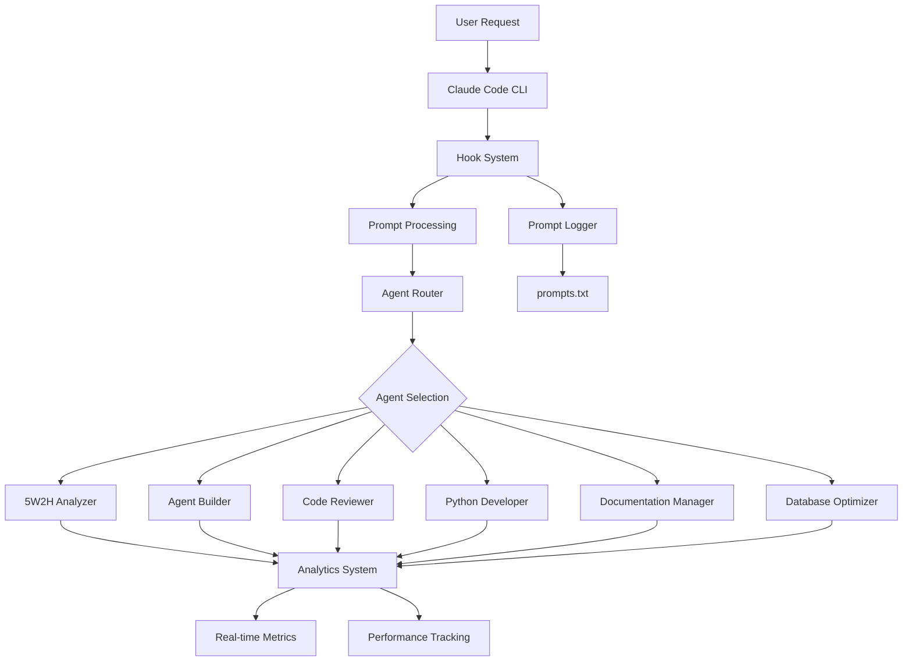

# Claude Code Technical Architecture Documentation

## Overview

This document provides a comprehensive technical overview of the Claude Code project, which implements an intelligent AI routing system with specialized agents, comprehensive analytics, and hooks-based automation.

## System Architecture



## Core Components

### 1. Agent System

The system utilizes specialized AI agents for different tasks:

#### Available Agents

| Agent | Purpose | Tools | Status |
|-------|---------|-------|--------|
| `5w2h-analyzer` | Systematic problem analysis using 5W2H methodology | Read, Write, Edit, Glob, Grep | ✅ Active |
| `agent-builder` | Meta-agent for creating new specialized agents | Read, Write, Edit, Glob, Grep, Bash | ✅ Active |
| `code-reviewer` | Expert code review and quality assurance | Read, Grep, Glob, Bash | ✅ Active |
| `python-developer` | Python development and optimization specialist | Read, Write, Edit, Glob, Grep, Bash | ✅ Active |
| `documentation-manager` | Technical and scientific documentation specialist | Read, Write, Edit, Glob, Grep, Bash | ✅ Active |
| `database-optimizer` | Database performance optimization specialist | Read, Write, Edit, Glob, Grep, Bash | ✅ Active |

#### Agent Configuration

Agents are defined as Markdown files with YAML frontmatter:

```yaml
---
name: agent-name
description: Agent purpose and capabilities
tools: Read, Write, Edit, Glob, Grep, Bash
version: 1.0.0
category: classification
author: Claude Code Agent Builder
created: 2025-08-31
status: active
---
```

#### Agent Storage

- **Location**: `.claude/agents/`
- **Format**: Markdown files with YAML frontmatter
- **Naming**: kebab-case (e.g., `5w2h-analyzer.md`)

### 2. Hook System

The hook system enables automated workflows and data capture:

#### Configuration

```json
{
  "hooks": {
    "UserPromptSubmit": [
      {
        "matcher": "",
        "hooks": [
          {
            "type": "command",
            "command": "jq -r '.prompt' >> /Users/taipm/GitHub/claude-code/prompts.txt"
          }
        ]
      }
    ]
  }
}
```

#### Hook Types

- **UserPromptSubmit**: Triggered when user submits a prompt
- **Command hooks**: Execute shell commands
- **Data capture**: Log prompts and interactions

### 3. Analytics System

Comprehensive metrics tracking and performance monitoring:

#### Metrics Storage

```
logs/analytics/
└── real-time-metrics.json
```

#### Tracked Metrics

- **System Performance**: Response times, resource usage
- **Agent Usage**: Task distribution, success rates
- **User Interactions**: Prompt patterns, tool usage
- **Health Monitoring**: Error rates, system status

### 4. Permission System

Fine-grained access control for tools and agents:

#### Configuration Files

- **Global**: `.claude/settings.json`
- **Local**: `.claude/settings.local.json`

#### Permission Types

```json
{
  "permissions": {
    "allow": [
      "Task(*)",
      "Task(agent-builder:*)",
      "Read(/Users/taipm/GitHub/claude-code/**)",
      "Bash(cat:*)"
    ],
    "deny": [],
    "ask": []
  }
}
```

## Agent Interaction Patterns

### Sequential Processing

```
User Request → Agent A → Agent B → Agent C → Final Output
```

Example: Code generation → Code review → Documentation

### Parallel Processing

```
User Request → [Agent A, Agent B, Agent C] → Aggregated Output
```

Example: Multi-perspective analysis

### Hierarchical Processing

```
Orchestrator Agent
├── Specialist Agent 1
├── Specialist Agent 2
└── Validator Agent
```

## Technical Specifications

### File Structure

```
claude-code/
├── .claude/
│   ├── agents/
│   │   ├── 5w2h-analyzer.md
│   │   ├── agent-builder.md
│   │   ├── code-reviewer.md
│   │   ├── python-developer.md
│   │   ├── documentation-manager.md
│   │   └── database-optimizer.md
│   ├── commands/
│   ├── hooks/
│   ├── settings.json
│   └── settings.local.json
├── logs/
│   └── analytics/
│       └── real-time-metrics.json
├── docs/
├── prompts.txt
├── CLAUDE.md
└── README.md
```

### Agent Development Workflow

1. **Requirements Analysis**
   ```bash
   Task(5w2h-analyzer:*) # Analyze requirements systematically
   ```

2. **Agent Creation**
   ```bash
   Task(agent-builder:*) # Create specialized agent
   ```

3. **Code Review**
   ```bash
   Task(code-reviewer:*) # Validate agent implementation
   ```

4. **Documentation**
   ```bash
   Task(documentation-manager:*) # Generate comprehensive docs
   ```

5. **Testing & Validation**
   ```bash
   Task(python-developer:*) # Test agent functionality
   ```

## Performance Considerations

### Agent Selection Optimization

- **Context Analysis**: Match agent capabilities to task requirements
- **Load Balancing**: Distribute tasks across available agents
- **Caching**: Store frequently accessed agent configurations

### Resource Management

- **Memory**: Each agent maintains separate context
- **Processing**: Parallel execution where possible
- **Storage**: Efficient prompt and analytics storage

### Monitoring & Alerting

- **Real-time Metrics**: System health monitoring
- **Performance Baselines**: Established benchmarks
- **Alert Thresholds**: Automated issue detection

## Security Model

### Access Control

- **Tool Permissions**: Fine-grained access to system tools
- **Agent Isolation**: Separate execution contexts
- **Data Protection**: Sensitive information handling

### Audit Trail

- **Prompt Logging**: Complete interaction history
- **Agent Activity**: Detailed execution tracking
- **System Changes**: Configuration modification logs

## Integration Guidelines

### Adding New Agents

1. Create agent file in `.claude/agents/`
2. Add permissions to `settings.local.json`
3. Test agent functionality
4. Update documentation

### Tool Integration

- **Available Tools**: Read, Write, Edit, Glob, Grep, Bash, Task
- **Permission Model**: Explicit allow-listing required
- **Safety Measures**: Sandboxed execution environment

### External System Integration

- **Git**: Version control integration
- **CI/CD**: Automated testing and deployment
- **Monitoring**: External metrics collection

## Troubleshooting

### Common Issues

#### Agent Not Found
```bash
Error: Agent type 'agent-name' not found
```

**Solution**: Verify agent file exists and permissions are configured

#### Permission Denied
```bash
Error: Tool access denied
```

**Solution**: Add appropriate permissions to `settings.local.json`

#### Configuration Errors
```yaml
# Invalid YAML frontmatter
---
name: agent-name
description: Missing quotes cause "parsing error
---
```

**Solution**: Validate YAML syntax and required fields

### Debugging Process

1. **Verify File Structure**: Check agent file exists and location
2. **Validate Configuration**: Test YAML frontmatter parsing
3. **Check Permissions**: Ensure tool access is granted
4. **Review Logs**: Examine analytics and error logs
5. **Test Incrementally**: Start with basic functionality

## Future Roadmap

### Planned Enhancements

- **Dynamic Agent Loading**: Hot-reload agent configurations
- **Advanced Routing**: AI-powered agent selection
- **Performance Optimization**: Caching and parallel processing
- **Extended Integrations**: Additional tool and platform support

### Research Directions

- **Multi-Agent Coordination**: Complex workflow orchestration
- **Learning Systems**: Agent improvement through feedback
- **Scalability**: Distributed agent execution
- **Intelligent Monitoring**: AI-powered system optimization

---

*This documentation is automatically maintained by the documentation-manager agent. Last updated: 2025-08-31*